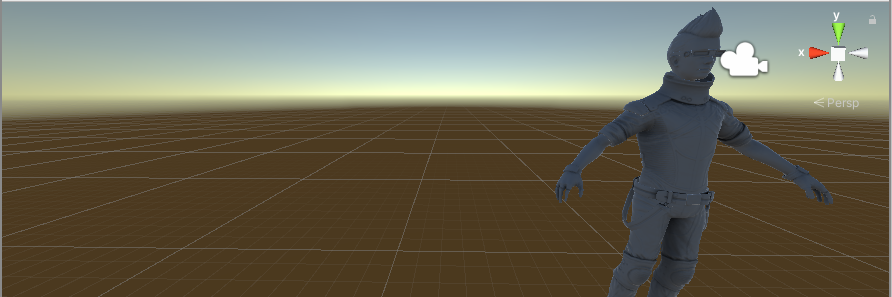

# What is AI4U?
AI4U is a multi-engine plugin (Godot and Unity) that allows you designing Non-Player Characters (NPCs) of games using a agent abstraction. In addition, AI4U has a low-level API that allows you to connect the agent to any algorithm made available in Python by the reinforcement learning community specifically and by the Articial Intelligence community in general. Reiforcement learning promises overcome tradicional navigation mesh mechanism in games and to provide more autonomous characters.

## Features

- Some examples.
- Support for multiple environment configurations and training scenarios.
- Flexible SDK that can be integrated into your game or custom Unity scene.
- API agnostic, but one provides support to all algorithms implemented by [stable-basiles](https://github.com/hill-a/stable-baselines).
- Integrated A3C implementation.
- Tools for facilated no-markovian decision making.
- AI4U can be integrated to Imitation Learning through Behavioral Cloning or
  Generative Adversarial Imitation Learning present on [stable-baslines](https://github.com/hill-a/stable-baselines).
- Train robust agents using environment randomization.
- Train using multiple concurrent Unity/Godot environment instances.
- Unity/Godot environment partial control from Python.
- Wrap Unity/Godot learning environments as a [gym](doc/ai4ugym.md).

# Maintainers
AI4U is currently maintained by Gilzamir Gomes (gilzamir@ufc.alu.br), Creto A. Vidal (cvidal@dc.ufc.br), Joaquim B. Cavalcante-Neto (joaquimb@dc.ufc.br) and Yuri Nogueira (yuri@dc.ufc.br).

## Important Note: We do not do technical support, nor consulting and don't answer personal questions per email.

#How To Contribute
To any interested in making the AI4U better, there is still some documentation that needs to be done. If you want to contribute, please read CONTRIBUTING.md guide first.

# Acknowledgments
AI4U was created in the CRab (Computer Graphics, Virtual Reality and Animations) Labs at UFC (Universidade Federal do Ceará).
