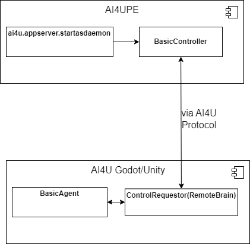

# AI4U Python Edition (AI4UPE) - Guia do Desenvolvedor

## Introdução
Durante muito tempo, pesquisadores de Inteligência Artificial se limitaram a usar mesas de teste jogos que outros construiram, como o clássico jogo de Xadrez. Os motores de jogos da atualidade possibilitam a construção de mundos muito mais complexos, mas ainda assim controláveis. E isso é feito de modo intutitivo. O objetivo da AI4U é conectar pesquisadores e estudantes de IA com tecnologias de desenvolvimento de jogos para que estes possam construir seus próprios ambientes de teste de algoritmos.  Para isso, construímos uma API que conecta as ferramentas mais usadas pela industria e pela academia a uma linguagem de programação que naturalmente suporta as mais modernas ferramentas de modelagem de experimentos de Inteligência Artificial, que é a linguagem Python.

Neste guia, mostramos a arquitetura do componente da AI4U chamado de AI4U Python Edition, que permite controlar objetos do motor de jogos por meio da linguagem Python. Mas, vai além disso, permite modelar ambientes nos motores de jogos suportados usando o paradigma de agentes inteligentes.

## Arquitetura 

AI4UPE permite controlar um agente na Unity e na Godot de uma maneira similar. Você não precisa ter dois scripts diferentes, pois o protocolo de comunicação entre o código Python e o motor de jogos é o mesmo, tanto faz ser Unity quanto Godot. Para isso, é importante entender que todo agente no ambiente tem um identificador (ID). E cada agente no ambiente tem um controlador que implementa o protocolo da AI4UPE. Em Python, para controlar o agente, deve-se criar um objeto controlador que é inicializado pelo método *startdaemon* do pacote *ai4u.appserver*. O controlador interpreta o estado do ambiente percebido pelo agente criado dentro do motor de jogos e envia as ações no formato que este agente compreenda. Observe que é papel do programador ajustar o nome, tipo e formato das percepções (dados enviados pelos sensores) e das ações (dados enviados aos atuadores) do agente.

Portanto, AI4U possui uma arquitetura resumida na Figura 1.



*Figure 1. Arquitetura da AI4U mostrando os seus quatro componentes principais: a função ai4u.appserver.startdaemon (resumidamente, startdaemon), um objeto que herda de BasicController que é inicializado pela função stardaemon, um objeto do tipo ControlRequestor associado a um item de jogo (agente) controlado pelo objeto do tipo BasicAgent*.

BasicController é a classe ai4u.agents.BasicController e provê a interface básica para controlar um agente do tipo BasicAgent. BasicController usa o protocolo da AI4UPE para abstrair a comunicação entre o código em Python e o agente criado no motor de jogos.

# Exemplo
Neste diretório [examples/ai4upe](/examples/ai4upe), há exemplos de controladores para três cenas. A cena *scene_samplescene* está implementada tanto em Godot quanto an Unity. O seguinde código (reference ao arquivo app.py) pode controlar por meio de comandos manuais o agente representado pelo corpo de capsula com seta mostrado na Figura 2 (o lado esquerdo tem o agente em Godot e o lado direito, em Unity).

Primeiramente importamos os módulos que contém os componentes de que precisamos.

```
import ai4u
from controller import SimpleController
from ai4u.appserver import startasdaemon
from ai4u import utils
```

O componente *SimpleController* herda de ai4u.agents.*BasicController* e implementa uma forma específica de comunicação com os agentes das cenas do projeto [AI4UTesting](/examples/unity/) e do projeto [AI4UGTesting](/examples/dodot/).

