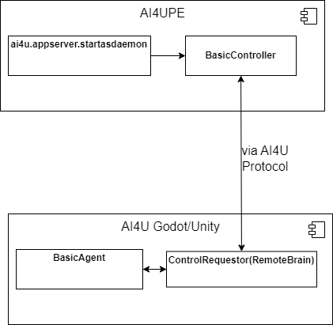

# AI4U Python Edition (AI4UPE) - Guia do Desenvolvedor

## Introdução
Durante muito tempo, pesquisadores de Inteligência Artificial se limitaram a usar mesas de teste jogos que outros construiram, como o clássico jogo de Xadrez. Os motores de jogos da atualidade possibilitam a construção de mundos muito mais complexos, mas ainda assim controláveis. E isso é feito de modo intutitivo. O objetivo da AI4U é conectar pesquisadores e estudantes de IA com tecnologias de desenvolvimento de jogos para que estes possam construir seus próprios ambientes de teste de algoritmos.  Para isso, construímos uma API que conecta as ferramentas mais usadas pela industria e pela academia a uma linguagem de programação que naturalmente suporta as mais modernas ferramentas de modelagem de experimentos de Inteligência Artificial, que é a linguagem Python.

Neste guia, mostramos a arquitetura do componente da AI4U chamado de AI4U Python Edition, que permite controlar objetos do motor de jogos por meio da linguagem Python. Mas, vai além disso, permite modelar ambientes nos motores de jogos suportados usando o paradigma de agentes inteligentes.

## Arquitetura 

AI4UPE permite controlar um agente na Unity e na Godot de uma maneira similar. Você não precisa ter dois scripts diferentes, pois o protocolo de comunicação entre o código Python e o motor de jogos é o mesmo, tanto faz ser Unity quanto Godot. Para isso, é importante entender que todo agente no ambiente tem um identificador (ID). E cada agente no ambiente tem um controlador que implementa o protocolo da AI4UPE. Em Python, para controlar o agente, deve-se criar um objeto controlador que é inicializado pelo método *startasdaemon* do pacote *ai4u.appserver*. O controlador interpreta o estado do ambiente percebido pelo agente criado dentro do motor de jogos e envia as ações no formato que este agente compreenda. Observe que é papel do programador ajustar o nome, tipo e formato das percepções (dados enviados pelos sensores) e das ações (dados enviados aos atuadores) do agente.

Portanto, AI4U possui uma arquitetura resumida na Figura 1.



*Figure 1. Arquitetura da AI4U mostrando os seus quatro componentes principais: a função ai4u.appserver.startasdaemon (resumidamente, startasdaemon), um objeto que herda de BasicController que é inicializado pela função stardaemon, um objeto do tipo ControlRequestor associado a um item de jogo (agente) controlado pelo objeto do tipo BasicAgent*.

BasicController é a classe ai4u.agents.BasicController e provê a interface básica para controlar um agente do tipo BasicAgent. BasicController usa o protocolo da AI4UPE para abstrair a comunicação entre o código em Python e o agente criado no motor de jogos.

# Exemplo
Neste diretório [examples/ai4upe](/examples/ai4upe), há exemplos de controladores para três cenas. A cena *scene_samplescene* está implementada tanto em Godot quanto an Unity. O código (reference ao arquivo app.py) pode controlar por meio de comandos manuais o agente representado pelo corpo de capsula com seta mostrado na Figura 2 (o lado esquerdo tem o agente em Godot e o lado direito, em Unity).


Vamos implementar um controlador manual (o próprio usuário envia comandos por meio da entrada padrão) para esta cena. Primeiramente importamos os módulos que contém os componentes de que precisamos.

```
import ai4u
from controller import SimpleController
from ai4u.appserver import startasdaemon
from ai4u import utils
```

O componente *SimpleController* herda de ai4u.agents.*BasicController* e implementa uma forma específica de comunicação com os agentes das cenas do projeto [AI4UTesting](/examples/Unity/) e do projeto [AI4GTesting](/examples/Godot/). O componente *utils*, dentre outras funcionalidades, provê a função import_getch, que pode ser usada no lugar da entrada padrão em Python.

Depois de importar os módulos necessários, deve-se instanciar o controlador e especificar o ID do agente controlado:

```
# neste caso há apenas um identificar, pois há apenas um agente.
ids = ["0"] 

# há um controlador para cada agente.
# Observe que informamos a classe e não o objeto.
controllers_classes =  [SimpleController]

#O método startasdaemon criar uma instância do controlador e o inicializa em uma thread separada. 

controller = startasdaemon(ids, controllers_classes)[0]
```

O método *startasdaemon* recebe a lista de identificadores de agente e uma lista de controladores correspondentes e então instancia o controlador em uma *thread* do tipo *daemon* e retorna a lista de objetos controladores instanciados. Na última linha de código, obtemos na mesma linha o único controlador retornado. Com este objeto, podemos enviar comandos para o agente modelado no motor de jogos e que roda em uma instância do jogo que criamos:

```
# Reinicializa o ambiente em um novo episódio.
state = controller.request_reset()
```

Neste exemplo, o comando *request_reset* de controller solicita a reinicialização do ambiente do agente, gerando um novo episódio. O tempo de vida do agente é dividida em episódios. O episódio somente inicializa depois que o comando *request_reset* for executado.

Também podemos enviar ações para o agente. O conjunto de ações que podemos enviar depende da forma como o agente foi modelado, ou seja, dos sensores e atuadores que o pesquisador adicionou ao agente. Por isso, a classe SimpleController teve que ser codificada especificamente para a cena *SampleScene*. Nesta cena, o agente em um corpo de capsula, como mostrado na Figura 2 e mode se movimentar em uma plataforma plana. O agente tem que alcançar o cubo evitando sair da plataforma. Se o agente sair da plataforma, ele cai e morre. Este agente suporta uma ação nomeada como "move" que recebe quatro números reais em um vetor *[fb, lr, j, jf]*, cujos valores representam:

* *fb* um valor no intervalo real [-1, 1], se o valor for positivo executa um movimento para frente com velocidade proporcional ao módulo de *fb*; se for negativo, faz um movimento para trás proporcional a *fb*.
* *lr* quantidade de graus que o agente pode girar (se for positivo, gira para à esquerda do agente, se for positivo, gira para a direita do agente).
* *j* intensidade do salto para cima (se for menor ou igual a zero, o agente não pula).
* *jf* intensidade do salto para frente (se for menor ou igual a zero o agente não salta).

Para enviar um comando desse tipo, basta executar o método *request_step* do *controller*

```
state, reward, done, info = controller.request_step(action)
```

onde *action* é um vetor de quadro números reais como acabamos de descrever; O método *request_step* retorna por padrão uma tupla com quatro elementos:

* state: o estado atual observado pelo agente;
* reward: a soma de recompensas recebidas durante o ciclo de decisão do agente;
* done: se o episódio terminou depois da última ação; e
* info: informações extras enviadas pelo próprio ambiente, geralmente o mesmo que *state*.


O arquivo [app.py](/examples/ai4upe/scene_samplescene/app.py) vai além e adiciona código para interação com o usuário. Para executar este exemplo, primeiramente execute o script usando a linguagem Python:

    python app.py

Depois, execute a cena no seu motor de jogos preferido (Godot ou Unity). Observe que você executar a cena apenas depois de executar o *script* que usa a AI4UPE, caso contrário, a cena será fechada por falta de comunicação com a AI4UPE.

# Criando seu próprio controlador
Em breve!
