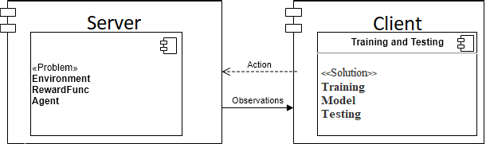
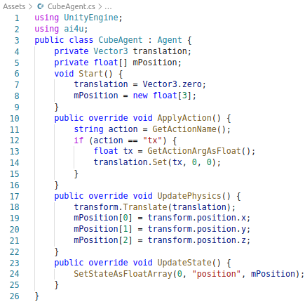
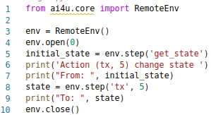

# **AI4U Programming Guide**

## *Summary*
    Introduction
    Low Level API Overview
        Client-Server Communication
        Basic of Server-Side Programming
        Basic of Client-Side Programming
    Reinforcement Learning Engine


## **Introduction**

AI4U API is composed of a client-side component and a server-side component. The client-side component runs Python code, while the server-side runs code written in C# for Unity applications. Then, AI4U integrates Python agents to control Unity game aspects. Figure 1 shows a low level view of the API logic.

|  |
| :--: |
| Figure 1. *An overview of AI4U API.* |

AI4U API provides a high level engine for reinforcement learning agents. Figure 2 shows an overview the API components.

|  |
| :--: |
| Figure 2. *An overview of reinforcement learning components on AI4U API.* |

## **Low Level API Overview**

### **Client-Server Communication**
AI4U encapsulates low-level client-server communication and lets the programmer define what actions the agent can perform in the environment. Programming the server so that the environment understands the actions sent by the agent is the responsibility of the programmer.

### **Basic of Server-Side Programming**

Server-side programming is made with C# components. First, you must import server side scritps into your project Assets directory. The server side scripts is in repository path *ai4u/serverside/baseline*.

|  |
| :--: |
| Figure 3. *Import server-side plugin to your Unity Project.* |

You can now create a empty game object and associate it with a *RemoteBrain* script. Then name this game object *remotebrain*. Select the game object *remotebrain*. See figures 4 and 5. 

|  |
| :--: |
| Figure 4. *Creating a empty game object* |


|  |
| :--: |
| Figure 5. *Selection of game object named remotebrain.* |

Click on **Add Component** button and select option **scripts->ai4u->RemoteBrain**. After that, note that remotebrain was associated with the selected script. This script contains several properties. Figure 6 shows this.

|  |
| :--: |
| Figure 6. *RemoteBrain object properties.* |

See in Figure 6 that **Agent** field's content is **None (Agent)**. This means no agent was associated with game object **remotebrain**. Now you have to create an agent that will be remotely controlled by a Python script. To do this, you must associate the created agent with the remotebrain object. Let's create a cube and associate a C # script called CubeAgent with this cube. Figure 7 shows the cube created. In this figure, the field **Number Of Fields** represents the number of properties to be sent to the client. In this example, the number of fields is one (1). This field contains the game object's position. Game object position is a float array with world coordinates x, y, and z of the game object. So, the fields are variables accessible to the python script. Table 1 resume properties of the RemoteBrain component.

Table 1: RemoteBrain component properties.

| Property        |                      Description |
|-----------------|---------------------------------------------------------------------------------------|
| Agent    |  Game Object controlled by Agent object                                           |
| Fixed Update      | If enabled, simulation step runs on FixedUpdate method, else one runs on Update method.                         |
| Update State On Update |  If enabled, even when the FixedUpdate option is enabled, the UpdateState method will run within Update, while the agent lifecycle methods will run in FixedUpdate (when FixedUpdate is enabled) or also in Update (when Fixed Update is disabled). 
| Port | Input port                     |
| Remote IP | host IP |
| Remote Port | Output Port
| Always Update | If enabled, simulation step runs always FixedUpdate (or Update) runs, else one runs only when RemoteBrain receives a new action from agent. |
| |

Now, we need to create a C# script that controls cube object. The C# script has two main roles. C# Script is an object that receives a Python commands from an agent (python script), and one sent resulting environment state to the agent. So, create a C# script named **CubeAgent** and add to the game object named Cube (see Figure 7). Modify the **CubeAgent** script so as shown in Figure 8. Note that the **CubeAgent** class is a child of the **Agent** class. The **ApplyAction** method of the **Agent** class is called whenever a new action is submitted by the client agent. Then the **UpdatePhysics** and **UpdateState** methods are called. The method **ApplyAction** receives the agent's command and prepares action to run on the environment. **UpdatePhysics** method deploys physics effects of the action on the environment. And **UpdateState** method sent updated state to client agent. So, **UpdatePhysics** should be used in substitution to **FixedUpdate**.  This behavior of a simulation step is valid in general for the default configuration shown in Figure 6. Table 1 shows the possibles configurations of the RemoteBrain object and your effects on the simulation step.


|  |
| :--: |
| Figure 7. *A Game Object controlled by Python script.* |


|  |
| :--: |
| Figure 8. *Server-side implementation of the agent CubeAgent.* |

It can be seen in the script shown in Figure 8 that there are several helpers methods that allow the script that controls the game object (the remote agent) to decoding (and encoding) the message received from the client agent. Table 2 summarizes the helpers and their functions in the simulation step.

Table 2: Remote agent helpers to message decoding.
| Property        | Params | Returns | Description |
|-----------------|--------|---------|-------------|
| GetActionName     |  void  | string: the value of the received message  | Returns the name of the received message (action). |
| GetActionArgAsInt | int: if message content is an array, the index of the returned element.  | int: the value of the received message | Returns the integer values of the received message.
| GetActionArgAsFloat | int: if message content is an array, the index of the returned element. | float: the value of the received message. | Returns the float values of the received message.
| GetActionArgAsBool | int: if message content is an array, the index of the returned element. | bool: the value of the received message. | Returns the bool values of the received message.
| GetActionArgAsString | int: if message content is an array, the index of the returned element. | string: the value of the received message. | Returns the string values of the received message.
| GetActionArgAsFloatArray | int: if message content is an array, the index of the returned element. | float[]: the value of the received message. | Returns float arrays as received message's content.
|  |  |  | 

So, there are helpers to encoding state-update messages sent to the client. These messages are named state-message. Table 3 shows the main helpers to sent state update-state messages to the client agent.

Table 3: Remote agent helpers to message encoding. All state-update messages return void. The message is sent as list of pairs *key:value*. So, all methods receive three arguments: an integer representing the property index, a string representing the key value, and the property value. The property index is used for performance purposes. For example, for you sent a message with property key "MSG" and with property value "I love you", you can write within method UpdateState: *SetStateAsString(0, "MSG" "I love you")*. So, python client can receive a dict with property "MSG".
| Property        | Value | Description |
|-----------------|---------|-------------|
| SetStateAsInt  | int  | Set an integer property for the state message. |
| SetStateAsFloat | float | Set a float property for the state message.
| SetStateAsString | string | Set a string property for the state message.
| SetStateAsBool | bool | Set a bool property for the state message.
| SetStateAsByteArray | byte[] | Set a byte array property for the state message.
| SetStateAsFloatArray | float[] | Set a float array property for the state message.
|  |  | 


Next, we can associate the game object **Cube** with the game object **remotebrain**. Figure 9 shows the final result after dragging the **Cube** object to the **Agent** field of the **remotebrain** object.


|  |
| :--: |
| Figure 9. *Cube associates the game object remotebrain.* |


### **Basic of Client-Side Programming**

After the server-side configuration, we can create the client script to control our cube. In this case, we like just move our cube to the right. Figure 10 shows a very simple script that does this.

|  |
| :--: |
| Figure 10. *Python script to control remote cube.* |

As can be seen in Figure 10, the first step in connecting a python client to your application made for Unity is to import the communication object named RemoteEnv:

    from ai4u.core import RemoteEnv

Then, it's necessary instantiate a object of type RemoteEnv:

    env = RemoteEnv()

The Object *RemoteEnv* communicates with the application through a simulation step represented by a call to the *step* method and its variants in object RemoteEnv. The method step receives two arguments: an action name, and the action argument. This method only accepts a simple type of argument. But before one call step, it's necessary to open a connection with the server using the calling *open* method. This method initializes a loop of communication with a Unity application. Method *open* receive only a float argument defining the *timeout* event occurrence after specified seconds. For example:

    env.open(0) #or env.open()


Therefore, the step method returns a dictionary containing the properties sent by Unity application (remember that we use one of the UpdateStateAs* methods to set property pairs KEY and VALUE, where * represents the various versions of this operation shown in Table 3).

So, the command

    state = env.step('tx', 5)

sent a message with action name 'tx' and *integer* value 5. If you want sent a float array indeed, you must use the follow command:

    state = env.stepfv('translation', [5, 0, 0]) # in this case, you should modify the server-side script to receive a message "translation" using GetActionName method, and get action arguments by means of GetActionArgAsFloatArray().
In Both step* versions, the command returns the new state values as a dictionary. So, the *state* variable is a python dictionary contenting the properties sent by the server-side script. So, one access to response field "position" can be made using

    state['position']

or one sent this value to output:

    state(response['position'])


#### Main client commands
The simplest use case of client-side programming consists of an agent that sends random actions to the environment. You must import the RemoteEnv class to establish a remote connection to the server.

```
from ai4u.core import RemoteEnv
```

Then, you must open a connection to the server.

```
env = RemoteEnv() #remote environment object to communicate with Unity
env.open() #open communication processing
```

You can now submit actions and receive the corresponding response synchronously.

```
state = env.step(acion_name, arg)
```

Where *action_name* is the name of an action that the environment can perform and *arg* is a supported action value. For now, we only support real, integer, boolean, and string actions.

Finally, after communication with the server has been completed, you can close the communication channel with Unity.

```
env.close()
```

Figure 10 shows a very simple client side script. 

## **Reinforcement Learning Engine**

#  *Under construction*

## **Conclusions**
In this guide, I showed you how to create a very simple Unity application that takes commands from a Python script. See this complete example [here](https://github.com/gilcoder/SimplestAI4UExample).

This is a very simple use case, hello world! Read other tutorials in the doc section to delve into UnityRemotePlugin.
