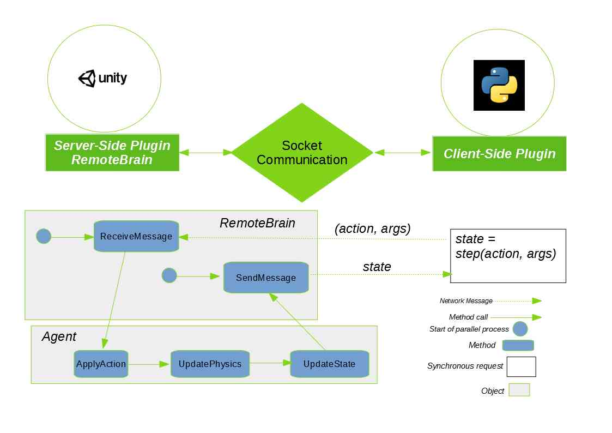
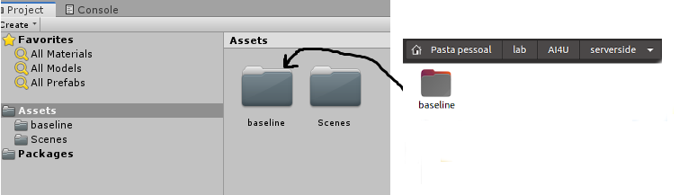
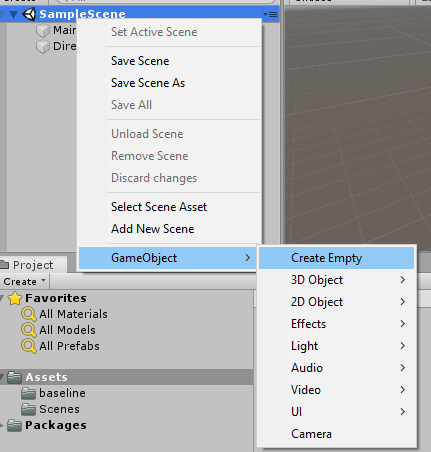
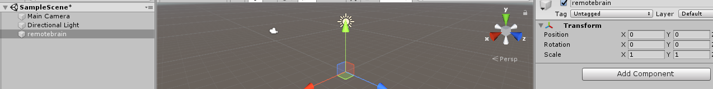
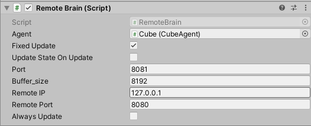
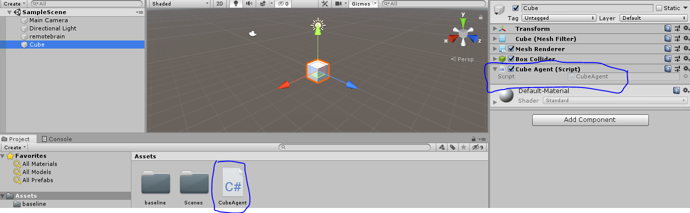
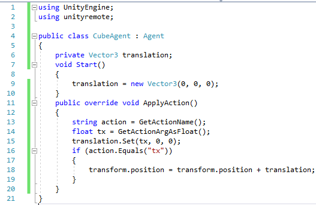
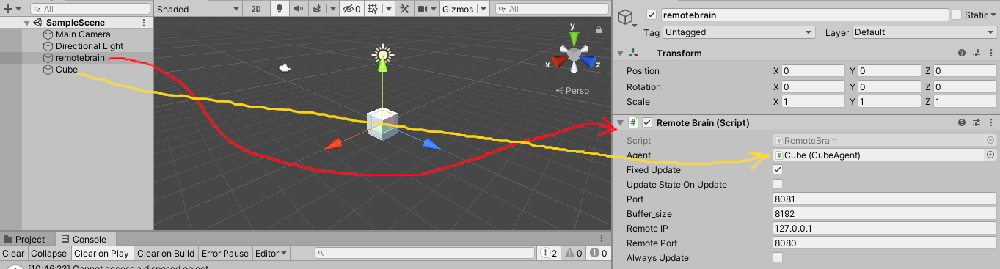
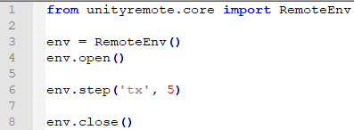

# Introduction to UnityRemotePlugin

UnityRemotePlugin (URP) is composed of a client-side component and server-side component. Client-server communication is via sockets based on UDP connections. The client-side component runs Python code, while the server-side runs code written in C# for Unity applications. Then, URP available as an Application Programming Interface (API) that facilitates integrating Python agents to control Unity game aspects. Figure 1 shows an overview of the URP API logic.

|  |
| :--: |
| Figure 1. *An Overview of URP API.* |

# Client-Server Communication
URP encapsulates low-level client-server communication and lets the programmer define what actions the agent can perform in the environment. Programming the server so that the environment understands the actions sent by the agent is the responsibility of the programmer.

# Basic of Server-Side Programming

Server-side programming is made with C# components. First, you must import the available scritps from the unityplugin/baseline directory into your project Assets directory.

|  |
| :--: |
| Figure 2. *Import server-side plugin to your UnityProject.* |

You can now create a empty game object and associate it with a RemoteBrain script. Then name this game object *remotebrain*. Select the game object *remotebrain*. See figures 3 and 4. 

|  |
| :--: |
| Figure 3. *Creating a empty game object* |


|  |
| :--: |
| Figure 4. *Selection of game object named remotebrain.* |

Click on **Add Component** button and select option **scripts->unityremote->RemoteBrain**. After that, note that remotebrain was associated with the selected script. This script contains several properties. Figure 5 shows this.

|  |
| :--: |
| Figure 5. *RemoteBrain object properties.* |

Now you have to create an agent that will be remotely controlled by a Python script. To do this, you must associate the created agent with the remotebrain object. Let's create a cube and associate a C # script called CubeAgent with this cube. Figure 6 shows the cube created.

|  |
| :--: |
| Figure 6. *A Game Object controlled by Python script.* |

Modify the **CubeAgent** script so as shown in Figure 7. Note that the **CubeAgent** class is a child of the **Agent** class. The **ApplyAction** method of the **Agent** class is called whenever a new action is submitted by the client. Then the **UpdatePhysics** and **UpdateState** methods are called. In this example, we will not use these last two methods. However, **UpdatePhysics** should be used in place of the traditional **FixedUpdate**. And the **UpdateState** method must be used to change state variables that will be provided to the client.

|  |
| :--: |
| Figure 7. *Server-side implementation of the agent CubeAgent.* |

After this change, we can associate the game object **Cube** with the game object **remotebrain**. Figure 8 shows the final result after dragging the **Cube** object to the **Agent** field of the **remotebrain** object.

|  |
| :--: |
| Figure 8. *Cube associates the game object remotebrain.* |

Finally, we can create the client script to control our cube. In this case, we can just move our cube to the right or left. Figure 9 shows a very simple script that does this.

|  |
| :--: |
| Figure 9. *Python script to control remote cube.* |


# Basic of Client-Side Programming
The simplest use case of client-side programming consists of an agent that sends random actions to the environment. You must import the RemoteEnv class to establish a remote connection to the server.

```
from unityremote.core import RemoteEnv
```

Then, you must open a connection to the server.

```
env = RemoteEnv() #remote environment object to communicate with Unity
env.open() #open communication processing
```

You can now submit actions and receive the corresponding response synchronously.

```
state = env.step(acion_name, arg)
```

Where *action_name* is the name of an action that the environment can perform and *arg* is a supported action value. For now, we only support real, integer, boolean, and string actions.

Finally, after communication with the server has been completed, you can close the communication channel with Unity.

```
env.close()
```

Figure 9 shows a very simple client side script. 

# Resume
In this brief tutorial, I showed you how to create a very simple Unity application that takes commands from a Python script. See this complete example in examples directory.

This is a very simple use case, hello world! Read other tutorials in the doc section to delve into UnityRemotePlugin.


