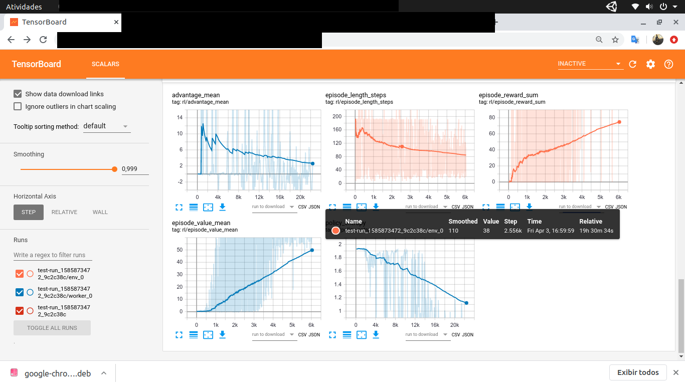

# A3C Implementation

Our A3C implementation is a fork of Rahtz's (Matthew) implementation of the vanilla A3C algorithm, available on [github](https://github.com/mrahtz/ocd-a3c). We adapt this implementation according to our requirements. Moreover, we extend A3C vanilla to a goal-parametrized A3C with intrinsic motivations and emotional models.

# Environment Configuration

UnityRemote provides a set of tools that allow you to use the A3C algorithm easily. Firstly, see the tutorial about the Gym-based environment available on [site](unityremotegym.md). UnityRemoteGym allows you to connect your Unity application with Python3 using a comprehensively known agent-environment protocol developed by the OpenAI Gym initiative.

The environment configuration can be made using a dictionary (see on [site](unityremotegym.md)). For example, 

        environment_definitions = {}
        environment_definitions['state_shape'] = (20, 20, 3)
        environment_definitions['action_shape'] = (4,)
        environment_definitions['actions'] = [('moveleft', 1), ('right', 1), ('moveup', 1), ('movedown', 1)]
        environment_definitions['agent'] = Agent
        environment_definitions['make_inference_network'] = make_inference_network

where *state_shape* field is the shape of the network input, *action_shape* field is the shape of the network output, *actions* field is a list of the action descriptors, *agent* field is a class representing the environment's agent, and *make_inference_network* is a function reference that builds agent network. Action descriptors is a list of pairs (*action_name*, *action_value*) where *action_name* is a description of the action, and *action_value* is a action's argument. An action is a command in your game.  You need to program your game to recognize the action. Action's argument indicates how action must be performed. The order of action in *actions* list is relevant. The first action in this list has index 0 (zero), the second action has index 1 (one), and so on. This index is used when the environment step called. For example:

    env.one_step(0)

acts *moveleft* that move left one cell on the matrix of a grid world.

# Buiding a Agent's Neural Network
A3C algorithm implementations use a neural network for approximating an optimal agent's police. The function *make_inference_network* should return a TensorFlow model representing the agent's network used by the A3C  algorithm.  For example, the following implementation makes a convolutional network that receives environment data and returns the agent's decision. When the method *act* from the agent is called, it receives the action selected by the agent's policy. The choice of this action depends on the agent's neural network.

	def make_inference_network(obs_shape, n_actions, debug=False, extra_inputs_shape=None):
	    import tensorflow as tf
	    from unityremote.ml.a3c.multi_scope_train_op import make_train_op 
	    from unityremote.ml.a3c.utils_tensorflow import make_grad_histograms, make_histograms, make_rmsprop_histograms, \
	        logit_entropy, make_copy_ops

	    observations = tf.placeholder(tf.float32, [None] + list(obs_shape))
	    proprioceptions = tf.placeholder(tf.float32, (None, ARRAY_SIZE) )
	    
	    normalized_obs = tf.keras.layers.Lambda(lambda x : x/3.0)(observations)

	    # Numerical arguments are filters, kernel_size, strides
	    conv1 = tf.keras.layers.Conv2D(16, (1,1), (1,1), activation='relu', name='conv1')(normalized_obs)
	    if debug:
	        # Dump observations as fed into the network to stderr for viewing with show_observations.py.
	        conv1 = tf.Print(conv1, [observations], message='\ndebug observations:',
	                         summarize=2147483647)  # max no. of values to display; max int32
	    
	    conv2 = tf.keras.layers.Conv2D(16, (3,3), (1,1), activation='relu', name='conv2')(conv1)
	    #conv3 = tf.layers.conv2d(conv2, 16, 3, 1, activation=tf.nn.relu, name='conv3')

	    phidden = tf.keras.layers.Dense(30, activation='relu', name='phidden')(proprioceptions[:, 0:ARRAY_SIZE])
	    phidden2 = tf.keras.layers.Dense(30, activation='relu', name='phidden2')(phidden)

	    flattened = tf.keras.layers.Flatten()(conv2)

	    expanded_features = tf.keras.layers.Concatenate()([flattened, phidden2])

	    hidden = tf.keras.layers.Dense(256, activation='relu', name='hidden')(expanded_features)
	    #hidden2 = tf.keras.layers.Lambda(lambda x: x * proprioceptions[:,9:10])(hidden)
	    #action_logits = tf.keras.layers.Dense(n_actions, activation=None, name='action_logits')(hidden2)
	    action_logits = tf.keras.layers.Dense(n_actions, activation=None, name='action_logits')(hidden)
	    action_probs = tf.nn.softmax(action_logits)
	    #values = tf.layers.Dense(1, activation=None, name='value')(hidden2)
	    values = tf.layers.Dense(1, activation=None, name='value')(hidden)

	    # Shape is currently (?, 1)
	    # Convert to just (?)
	    values = values[:, 0]

	    layers = [conv1, conv2, phidden, phidden2, flattened, expanded_features, hidden]

	    return (observations, proprioceptions), action_logits, action_probs, values, layers

# The Agent

The agent implementation should follow the directives given in [site](unityremotegym.md). For example, the following implementation receives the action selected by the agent's policy and returns the next state resulting in this action.

	class Agent:
	    def __init__(self):
	        self.energy = None
	        self.buf = deque(maxlen=4)
	        mem = np.zeros(shape=(20, 20))
	        self.buf.append(mem.copy())
	        self.buf.append(mem.copy())
	        self.buf.append(mem.copy())
	        self.buf.append(mem.copy())

	    def __make_state__(env_info, imageseq):
	        proprioceptions = np.zeros(ARRAY_SIZE)
	        frameseq = np.array(imageseq, dtype=np.float32)
	        frameseq = np.moveaxis(frameseq, 0, -1)
	        frameseq = np.array(imageseq, dtype=np.float32)
	        frameseq = np.moveaxis(frameseq, 0, -1)
	        proprioceptions[0] = env_info['touched']
	        proprioceptions[1] = env_info['energy']/300.0
	        proprioceptions[2] = env_info['signal']
	        proprioception = np.array(proprioceptions, dtype=np.float32)
	        state = (frameseq, proprioception)

	    def act(self, env, action=0, info=None):
	        env_info = env.one_step(action)

	        frame = get_frame_from_fields(env_info)

	        if self.energy is None:
	            self.energy = env_info['energy']

	        done = env_info['done']
	        delta = env_info['energy'] - self.energy
	        reward = 0
	        if not done:
	            if self.energy > 200:
	                if delta > 0:
	                    reward = -delta
	            else:
	                reward = delta
	                if reward < 0:
	                    reward = 0;
	            info = fields
	            self.energy = env_info['energy']
	        else:
	            self.energy = None

	        self.buf.append(frame)
	        state = Agent.__make_state__(env_info, self.buf)

	        return (state, reward, done, fields)

# Run A3C algoritm

Assuming you have already set up your simulation environment and agent, the next step is to start agent training. To do this, you need to call the run method of the module *unityremote.ml.a3c.train*, as shown in the following example.

	from unityremote.ml.a3c.train import run as run_train
	def train():
	        args = ['--n_workers=8', '--steps_per_update=30', 'UnityRemote-v0']
	        environment_definitions = make_env_def()
	        run_train(environment_definitions, args)

where *args* is a list of arguments to our A3C implementation, and  *environment_definintions* is a dictionary with the configuration of the environment. The parameter *--n_workers* in args is the number of workers running during the training, *--steps_per_updates* is the number of update steps to consider during A3C training, and *UnityRemote-v0* is the default name of all unityremote plugin in gym environment management.

# Testing

After training, to view the result obtained, you can run the environment with the optimized model. To do this, run the *run* method of the *unityremote.ml.a3c.run_checkpoint* module, as shown in the following example.

	from unityremote.ml.a3c.run_checkpoint import run as run_test
	def test(path):
        args = ['UnityRemote-v0', path]
        make_env_def()
        run_test(environment_definitions, args)

# Final Considerations

The complete code example shown in this tutorial can be found at [examples/MazeWorld](/examples/MazeWorld). In this environment, the maximum agent's score is 100. After one day and twelve hours of training agents meet the maximum score. Image 1 shows the result.

|  |
| :--: |
| Figure 1. *MazeWorld Agent obtains maximum score after one day and twelve hours of training.* |