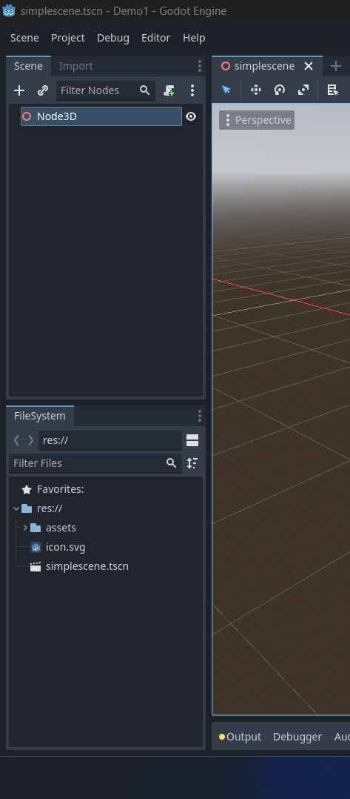
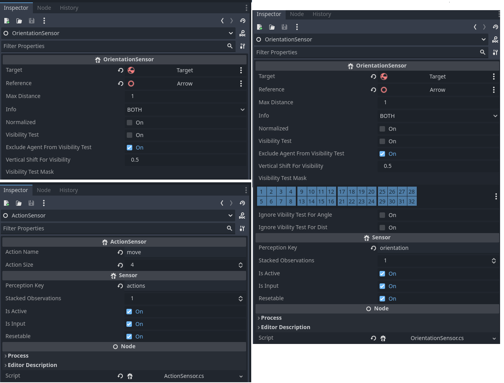
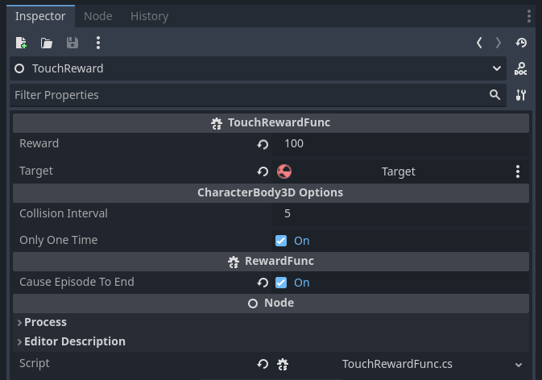
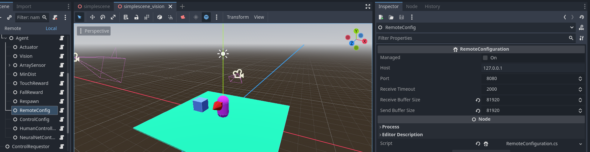

# Introduction

[Summary](summary.md)

AI4U (Artificial Intelligence for You) is an open tool that brings an AI-based behavior modeling abstraction to Godot. The agent abstraction is used to allow solution sharing. Each component of an agent can be produced, improved, shared, and reused. The components of an agent are sensors, actuators, reward functions, a controllable item, and a controller.

The agent perceives the game world through sensors and acts in this world through actuators. The mapping between sensors and actuators is performed by a controller. Based on the observation history, the controller decides which action to take. The actions modify the agent's controllable object or the surrounding environment.

This tutorial is entirely based on Godot version 4.2.2 (.NET version). The [official Godot documentation on using C#](https://docs.godotengine.org/en/stable/tutorials/scripting/c_sharp/c_sharp_basics.html) is a good starting point to fully understand this tutorial.

# How to Implement an Agent in Godot?

In Godot, an agent is composed of a virtual body, sensors, actuators, and a controller. A virtual body can be an object of type RigidBody2D, CharacterBody2D, RigidBody3D, CharacterBody3D, Node2D, Node3D, or any other object that the agent can control.

> However, for a controllable object to be useful, actuators and sensors must be specifically created for it. For now, these are the implemented sensors and actuators and the types of bodies they support:

|    Actuator/Sensor/Controller |          Role          |     Type        |
| ----------------------------- | ---------------------- | --------------- |
|       CBMoveActuator          |         Actuator       | CharacterBody3D |
|       RBMoveActuator          |         Actuator       |   RigidBody3D   |
|       RBMoveActuator2D        |         Actuator       |   RigidBody2D   |
|       RBRespawnActuator*      |         Actuator       |   RigidBody3D   |
|       CBRespawnActuator*      |         Actuator       | CharacterBody3D |
|       DiscretActuator         |         Actuator       |   Node2D/Node3D |
|       Camera3DSensor***       |         Sensor         |      Node3D     |
|       ActionSensor            |         Sensor         |   Node2D/Node3D |
|     LinearRayRaycasting***    |         Sensor         |      Node3D     |
|     OrientationSensor***      |         Sensor         |      Node3D     |
|     RewardSensor              |         Sensor         |   Node2D/Node3D |
|     ScreenSensor              |         Sensor         |   Node2D/Node3D |
|    GroundStatusSensor***      |         Sensor         |      Node3D     |
| ArrowPhysicsMoveController*** |       Controller       |      Node3D     |
| DiscretArrowController        |       Controller       |   Node2D/Node3D |

\* These actuators are used only to position the agent in some part of the scene at the beginning of an episode.

\*\* It can be any object of type Node2D or Node3D or any subtype of these. The object must support the message **SetAction(action)**, which receives the **action** argument, an integer greater than or equal to zero.

\*\*\* These sensors can be applied to any supported Node3D (in this case, RigidBody3D and CharacterBody3D).

## Installing AI4U

The best way to install AI4U in your project is by downloading the [AI4U repository](https://github.com/gilzamir18/AI4U) to your computer.

Then, create a new C# project in Godot (leave the default project creation options).

Copy the **addons** directory from the AI4U repository to your project. This is enough for Godot to recognize the classes you need to model an agent. However, to train this agent using reinforcement learning, you need to install the [*AI4U/pyplugin* component](https://github.com/gilzamir18/ai4u). This plugin allows you to connect your agent in Godot with a Python framework, which enables training the agent. AI4U and the *pyplugin* were specially designed to communicate properly with the [stable-baselines3 framework](https://github.com/DLR-RM/stable-baselines3).

Once you have installed AI4U, the pyplugin, and **stable-baselines3**, continue reading this tutorial.

# A Basic Example

In Godot, the structure of an agent is a tree of nodes whose root is the controllable object (the agent's body). This structure has slight variations depending on the controllable object.

## Creating a Rigid Body Agent

Let's now modify your project to create a rigid body agent. Create a project named [BoxChase](https://github.com/gilzamir18/ai4u_demo_projects/tree/main/BoxChase). We need to create a scene where our agent will live and interact with objects. For now, let's create a very simple scene. To do this, choose the *3D Scene* option, as shown in *Figure 1*. Press CTRL+S to save the scene, as shown in *Figure 2*.


*Figure 1. The scene creation options are shown in the upper left panel.*


*Figure 2. Saving a scene.*

So far, I assume you have copied the *addons* directory from the AI4U repository to your project. If so, your project should look like the one shown in Figure 3.



*Figure 3. Project with AI4U assets.*

## Creating the Environment

Now let's create the scene. The scene consists of a flat floor with a box and an agent (represented by a capsule) on the floor. The agent can move in the scene and aims to approach and touch the box. The agent gains a reward every time it gets closer to the box and a greater reward when it touches it. The episode ends when the agent touches the box, so the touch should generate a high reward. The agent is penalized when it falls off the plane representing the ground. In this case, the episode also ends.

Let's model the ground as a plane. To do this, create an object of type *StaticBody3D* as a child of Node3D (the root node of the scene). A *StaticBody3D* object must also have a *CollisionShape* or *CollisionPolygon3D* child object. We will use *CollisionShape3D*. Then, in the *Shape* resource of this object, create a *BoxShape3D*, with the *Size* property parameters modified to *x=10m*, *y=0.1m*, and *z=10m*. Also, add a *MeshInstance3D* as a child of the *StaticBody3D*, which represents the visual mesh of the scene's floor. Change the x, y, and z parameters of the *Scale* property to *x=10*, *y=0.1*, and *z=10*. Figure 4 shows these configurations made.


*Figure 4. Hierarchy of the StaticBody3D object and configuration of its mesh.*

Now let's create a box that represents our target, the object to be touched. The process of creating this box is very similar to that of the floor, except that at the root we place an object of type RigidBody3D, as shown in Figure 5. The *CollisionShape3D* object of the target should have a *BoxShape3D* and a *MeshInstance3D* with a *BoxMesh*. We can leave these target objects with their default properties, except for the RigidBody3D, which we move to the position indicated in *Figure 5*.


*Figure 5. Hierarchy of the RigidBody3D object and configuration of its Transform component.*

These objects will remain fixed in the scene. Rename the *StaticBody3D* node to *Floor*; and the *RigidBody3D* to Target. Thus, our scene looks like the one shown in *Figure 6*.


*Figure 6. Renaming scene components.*

## Agent Structure

Now let's create an agent that learns to approach and touch the target without falling off the plane. To do this, create a node of type RigidBody3D and add a CollisionShape3D and a MeshInstance3D as we did for the target, except that the Shape and Mesh should be of type CapsuleShape3D and MeshInstance3D (with Mesh configured to be a capsule), respectively. Position the capsule to be on the plane. Additionally, change the colors of the plane, target, and agent. This can be done by changing the *Surface Material Override* field of the *MeshInstance3D* of each object. The partial structure of the agent is shown in *Figure 7*.


*Figure 7. Partial scene version.*

Notice that the agent as a 3D object should have a front direction. In Godot, we use the z-axis to indicate the front direction of a 3D object. However, this axis is not visible and, when the agent is moving in the scene, we won't know which side is

 the front since the capsule is symmetrical. To solve this, in *assets/3DModel*, select the Arrow.dae model and drag it as a child of RigidBody3D. Change the arrow's dimensions and orientation to look like the one shown in *Figure 8*.


*Figure 8. Partial scene version with the agent's front face indicated by a red arrow.*

We have completed the agent's physical body and appearance, but we haven't done much about how the agent perceives the environment and acts in this world. But before doing that, let's change the name of the RigidBody3D node to AgentBody, so we know it is the agent.

The agent needs a main module called *RLAgent*, capable of coordinating its sensors and actuators through a controller.

To create a *RLAgent* node, create a child node of the AgentBody node and change its name to *Agent*. In this node's *script* property, add the *RLAgent* script (use the *Quick Load* property for this). As soon as you add this script, nothing will change in the *Inspector*. Godot will only show the properties of the added component after a new compilation. So, set the current scene as the project's main scene. Then, click *build* to compile the project for the first time. Then, press CTRL+F5. A black screen will open since there is no camera and no light in the scene. But this first compilation was just for Godot to recognize the properties of the *RLAgent* object.

> For the compilation to work correctly, you need to create a C# solution. To do this, in the Project menu, select Tools >> C# >> "Create C# Solution". Now, your project can be compiled correctly.

After compiling the project for the first time, the properties of the RLAgent script will be shown in the Godot *Inspector*. Configure these properties as shown in *Figure 9*.


*Figure 9. Agent configurations. The Remote option indicates that the agent will communicate with a remote controller (a Python script). When remote is unchecked, you must use either the NeuralNetController (to load a neural network directly in Godot) or an ArrayPhysicsMoveActuator combined with RBMoveActuator or RBMoveActuator2D (to control the agent directly with the arrow keys). The last option is excellent for testing the game's physics before training the agent. The *Max Steps Per Episode* option indicates the maximum number of steps (time steps) in an episode.*

*Figure 10* shows the current structure of the project.


*Figure 10. Current project structure.*

Our agent is still very simple, without sensors and actuators. It is necessary to add actuators and sensors to the agent. Let's use an actuator of type *RBMoveActuator* and a sensor of type *Camera3DSensor*. Add an actuator of type *RBMoveActuator* as a child of the **Agent** node with the settings shown in *Figure 11*. Also, create the node structure shown in *Figure 11*. To create the child nodes of **Agent**, right-click on this node and select the option to create a new node. Select the generic Node option and change the name of this node to one of the names shown in *Figure 11*, under *Agent*.

> Note: Whenever we create an AI4U object, we create a generic Node and then add an AI4U script, such as *RLAgent* and *RBMoveActuator*. From now on, to simplify the writing, we will just say: create a node of type *RLAgent*.


*Figure 11. Agent actuator.*

In *Figure 12*, we show the node named Vision containing a *Camera3DSensor* script.


*Figure 12. Properties of the Vision sensor of the agent, which will produce a sequence of 3 grayscale images with a resolution of 61x61 pixels each.*

The *Vision* sensor is the type that allows the agent to visualize the world from the point of view of a Camera3D placed in the scene. We place this camera as a child of the *AgentBody* node. Thus, whenever the agent rotates, the camera rotates the agent's view. Note that the *Camera* property of the Camera3DSensor points precisely to an object named AgentCam, which is a Camera3D object, as shown in *Figure 13*.


*Figure 13. Agent camera.*

Finally, at each simulation step, the vision sensor will produce a sequence of 3 grayscale images with a resolution of 61x61 pixels each. But for the agent to learn effectively, it needs to perceive its actions and have direct information about its spatial orientation relative to the target (the cube to be chased). For this, let's add two more sensors grouped in a single sensor of type *FloatArrayCompositeSensor*. Within this node, we create the nodes that represent the two extra sensors we need, namely the *OrientationSensor* node (of type *OrientationSensor*) and the *ActionSensor* node (of type *ActionSensor*). In *Figure 14*, we show the configurations of all these nodes.



*Figure 14. Configurations of **ArraySensor** on the right. Configuration of the **OrientationSensor** node in the upper right corner. And configuration of the **ActionSensor** in the lower left corner.*

> We can stack multiple observations in sequence using the *Stacked Observations* property. This can make the model more effective, but it also increases the amount of computation required to train the model. For the agent's behavior to learn, we need to transform the agent's observation into something more informative without increasing its complexity too much. For this, we developed a set of sensors suitable for making the agent's perceptions more informative. In reinforcement learning jargon, we say that the agent's observations represent a Markovian state for the task to be learned. Therefore, we use two sensors: *OrientationSensor* and *ActionSensor*. As shown, we create them as children of a FloatArrayCompositeSensor node, configured as shown in *Figure 14*. A *composite* type sensor groups multiple sensors, making them appear to the training algorithm as a single sensor.

Check the values of the sensors and actuators and configure them according to the images shown.

Now we have an agent capable of moving and perceiving the world. But this agent still doesn't have a goal. Let's add goals to the agent through reward functions. Add two more objects of type Node as children of the Agent node: one of type *MinDistReward* and the other of type *TouchRewardFunc*. The first gives a reward whenever the agent performs an action that brings it closer to the goal. The second gives a reward when the agent touches the target. In *Figure 15*, we show how the MinDist function was configured. In *Figure 16*, we show how the *TouchReward* function was configured.


*Figure 15. Properties of the MinDist reward function.*



*Figure 16. Properties of the TouchReward function.*

It is necessary to penalize the agent if it falls off the platform. To do this, as shown in Figure 17, we add a fall reward function (FallRewardFunc).


*Figure 17. Reward generated when the agent falls below a certain level indicated by the Threshold field.*

We may want the agent to appear in the scene in various random positions. For this, we will add an extra actuator to the agent. This actuator only runs before the start of an episode. Create a node of type RBRespawnActuator, as shown in Figure 18. Note that this node contains the *Respawn Option Path* property, which points to a subtree of the scene containing several Node3D with positions for the agent to respawn. Place some positions covering the scene area.


*Figure 18. Respawn component of the agent.*

The AI4U training system uses network communication transparently to the user whenever possible. The user runs the training script in Python, using the AI4U Gymnasium interface, and runs the Godot game produced with AI4U or the game directly in the Editor. I prefer to use the editor directly during the experiment design phase. However, sometimes customizations are necessary. Our agent sends an image with a spatial resolution of 61x61, resulting in 29768, which is larger than the standard network buffer size. To solve this problem, we add, as a child of the *Agent* node, a RemoteConfig node (associated with the RemoteConfiguration script), as shown in Figure 19.



*Figure 19. Network communication settings of the agent with the Python script.*

The agent's control loop does not necessarily have to coincide with Godot's physical simulation loop. We can determine that the agent will capture observations only every 4 physical steps and determine that in the frames without action, the last selected action by the agent is repeated. These configurations are already the defaults, but you can change them by adding a ControllerConfiguration node as a child of the Agent node, as shown in Figure 20.


*Figure 20. Agent control loop configurations.*

There are still two optional nodes, but they are present in this environment: one of type **ArrowPhysicsMoveController** (named *HumanController* in

 our example), which allows us to handle agents with RigidBody3D or CharacterBody3D with the keyboard; and the other of type **NeuralNetController** (named *NeuralNetController* in our example), which allows the agent to be controlled by a neural network loaded from an ONNX file. In other tutorials, I explain these nodes in detail. The configurations of these nodes used in this experiment are shown in Figure 21. Although optional, the *ArrowPhysicsMoveController* node is excellent for testing the environment and the agent before conducting an expensive and time-consuming training session.


*Figure 21. Configurations of the optional nodes in our scene.*

We are almost ready to train our agent. We need to create the object that creates the control loop for all agents in the environment. To do this, create a node of type *ControlRequestor* and add it as a child of the scene's root. This node can be anywhere in the scene, and you must explicitly specify which agents will be executed in the environment. In Figure 22, the ControlRequestor of this demonstration is shown.


*Figure 22. Agent loop configurations.*

Now we can train our agent. To do this, create a Python file (let's say, trainer.py) and copy the following content into it:

```python
import ai4u
from ai4u.controllers import BasicGymController
import AI4UEnv
import gymnasium as gym
import numpy as np
from stable_baselines3 import SAC
from stable_baselines3.sac import MultiInputPolicy

env = gym.make("AI4UEnv-v0")

model = SAC(MultiInputPolicy, env, verbose=1, tensorboard_log="SAC")
print("Training....")
model.learn(total_timesteps=30000, log_interval=4, tb_log_name='SAC')
model.save("ai4u_model")
print("Trained...")
del model # remove to demonstrate saving and loading
print("Train finished!!!")
```

Ensure that all required modules are installed (bemaker, pytorch, stable-baselines3, and gymnasium). Now, run the Python program:

```sh
$> python trainer.py
```

Observe the agent's behavior at the beginning of the training; it moves strangely on the plane and not as it should. To fix this, close the Godot game window. Now, go to the AgentBody node of the agent and modify the *Axis Lock* property as shown in *Figure 23*.


*Figure 23. Axis Lock configuration of the AgentBody of the agent.*

> Final adjustments: In the RigidBody3D of all objects that can collide, enable the *Contact Monitor* property. Also, change the *Max Contacts Reported* property to a value greater than zero (I used 10000). These changes are essential for the proper functioning of the *TouchRewardFunc*. For more precise physics calculations, enable the *Continuous CD* properties of the agent's RigidBody3D. Specifically for the target's RigidBody3D (Target object), enable the *Freeze* and *Lock Rotation* properties. Specifically for the agent's RigidBody3D, change the *Damp* property in the *Angular* tab to 5. This property is essential for achieving smooth rotation of the agent's body.

After running the training script, you should observe something like what is shown in *Figure 24*.


*Figure 24. Agent training.*

After approximately 16,000 neural network update steps of the agent, the result is as shown in *Figure 25*.


*Figure 25. Several steps after the beginning of agent training.*

After training the agent, a *ai4u_bemaker.zip* file is generated (or another name you have defined in the training script). This file contains the neural network model that knows how to control the agent to perform a task. We can run this model using a loop in Python or using the model directly in Godot. To use Python, create a test file (let's say, run.py) with the following content:

```python
import gymnasium as gym
import numpy as np
from stable_baselines3 import SAC
from stable_baselines3.sac import MultiInputPolicy
import ai4u
from ai4u.controllers import BasicGymController
from ai4u.onnxutils import sac_export_to, read_json_file
import AI4UEnv

env = gym.make("AI4UEnv-v0")

print('''
bemaker Client Controller
=======================
This example controls a movable character in the game.
''')
model = SAC.load("ai4u_model")

sac_export_to("ai4u_model", metadata=env.controller.metadataobj)

obs, info = env.reset()

reward_sum = 0
while True:
    action, _states = model.predict(obs, deterministic=True)
    obs, reward, done, truncated, info = env.step(action)
    reward_sum += reward
    env.render()
    if done:
        print("Testing Reward: ", reward_sum)
        reward_sum = 0
        obs, info = env.reset()
```

Now run the file with the following command:

```sh
$> python run.py
```

Run the scene and see the result.

> Change the execution speed of the *ControlRequestor* by changing the *Default Time Scale* value to 1.

In the document [Introduction to ONNX Model](introductionwithonnxmodels.md), I show how to run the model directly in Godot without using Python.


*Figure 26. Agent after training.*

Note that in the directory where you ran the training script, a directory named SAC was created. This directory creates TensorBoard log files for you to check the training progress in graphs. In the Linux/Windows terminal, access the SAC directory and type the command:

```sh
python -m tensorboard.main --logdir .
```

or

```sh
python -m tensorboard.main --port 6007 --logdir .
```

Then, open the suggested link from TensorBoard in a browser (usually *http://localhost:6006*). The results may look like those shown in *Figure 27*.


*Figure 27. Final training result.*

Learn how to convert the model to run directly in Godot: [tutorial](introductionwithonnxmodels.md).


