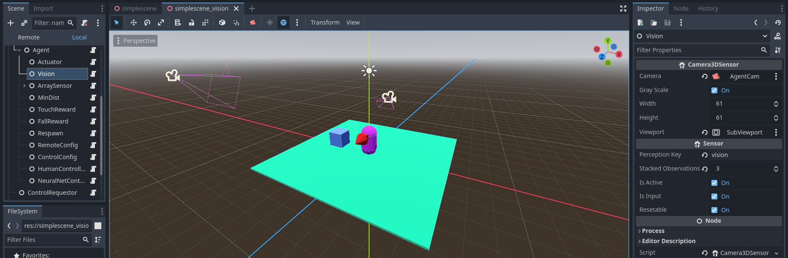

# Introdução

AI4U (Artificial Intelligence for You) é uma ferramenta aberta que traz para a Godot uma abstração de modelagem de comportamentos baseada em Inteligência Artificial. A abstração de agente é usada de maneira a permitir o compartilhamento de soluções. Cada componente de um agente pode ser produzido, aperfeiçoado, compartilhado e reaproveitado. Os componentes de um agente são: sensores, atuadores, funções de recompensa, um item controlável e um controlador.

O agente enxerga o mundo do jogo por meio de sensores e atua neste mundo por meio de atuadores. O mapeamento entre sensores e atuadores é realizado por um controlador. Com base no histórico de percepções, o controlador decide qual ação executar. As ações alteram o objeto controlável do agente ou o ambiente ao redor. 

# Como implementar um agente na Godot?

Em Godot, um agente é composto por um corpo virtual, sensores, atuadores e um controlador. Um corpo virtual pode ser um objeto do tipo RigidBody2D, RigidBody3D, Node2D, Node3D, ou qualquer outro objeto que o agente tenha controle sobre.

> Contudo, para que um objeto controlável seja útil, é necessário que atuadores e sensores possam ser criados especificamente para ele. Por enquanto, damos suporte apenas para RigidBody3D, mas qualquer programador pode extender nossa biblioteca de classes para suportar outros tipos de objetos.


## Instalando a AI4U
A melhor forma de instalar a AI4U em seu projeto é baixando em seu computador o respositório [AI4U](https://github.com/gilzamir18/AI4U). 

Então, crie um novo projeto C# na Godot (deixe as opções padrões de criação de projeto).

> Por enquanto, AI4U roda apenas projetos 3D.

Copie o diretório **assets** do repositório AI4U para o seu projeto. Isto é o suficiente para a Godot reconhecer as classes que você precisa para modelar um agente. Mas, para treinar este agente usando aprendizagem por reforço, é necessário baixar e instalar o utilitário [bemaker](https://github.com/gilzamir18/bemaker). Este repositório permite você conectar o seu agente na Godot com um framework Python que permite treinar o agente. AI4U e bemaker são especialmente projetados para se comunicarem adequadamente com o framework [stable-baselines3](https://github.com/DLR-RM/stable-baselines3).

Uma vez que você tenha instalado AI4U, **bemaker**, **stable-baselines3**, continue lendo este tutorial.

# A Estrutura de um Agente na Godot

Na Godot, a estrutura de um agente é uma árvore de nós cuja raiz é o objeto controlável (o corpo do agente) pelo agente. Essa estrutura possui pequenas variações, a depender do objeto controlável.

## Criando um agente de corpo rígido
Vamos agora modificar o seu projeto para criarmos um agente com corpo rígido. Crie um projeto denominado [Demo1](https://1drv.ms/u/s!AkkX5pv0cl3aieYYTQz_d9S1kVhJAQ?e=rlCgnh). É preciso criar uma cena onde nosso agente vai viver e interagir com objetos. Por enquanto, vamos criar uma cena muito simples. Para isso, escolha a opção *3D Scene*, como mostrado na *Figura 1*. Execute o atalho CTRL+S para salvar a cena, como mostrado na *Figura 2*.


*Figure 1. As opções de criação de cena são mostradas no painel superior esquerdo.*


*Figure 2. Salvando uma cena.*

Até aqui, suponho que você já copiou o diretório *assets* do repositório AI4U em em seu projeto. Se sim, seu projeto deveria estar como mostrado na Figura 3.


*Figure 3. Projeto com assets da AI4U.*

Agora vamos criar a cena. A cena consiste de um piso plano com uma caixa e um agente (representado por uma capsula) sobre o piso. O agente pode se movimentar na cena e tem como objetivo se aproximar e tocar a caixa. O agente ganha uma recompensa toda vez que se aproxima da caixa e uma recompensa maior quando a toca. O episódio termina quando o agente toca a caixa, por isso, o toque deve gerar uma alta recompensa. O agente é penalizado quando cai do plano que representa o terreno. Neste caso, o  episódio também termina.

Vamos modelar o terremo como um plano. Para isso, crie um objeto do tipo *StaticBody3D* como filho de Node3D (o nó raiz da cena). Um objeto do tipo *StaticBody3D* também tem que ter como filho um objeto do tipo *CollisionShape* ou do tipo *CollisionPolygon3D*. Vamos usar *CollisionShape3D*. E então, no recurso *Shape* deste objeto, crie uma *Shape* do tipo *BoxShape3D*, com os parâmetros da propriedade *Size* modificados com *x=10m*, *y=0.1m* e *z=10m*. Também adicione  como filho do *StaticBody3D* um objeto do tipo *MeshInstance3D*, que representa a malha visual do chão da cena. Altere os parâmetros x, y e z da propriedade *Scale* para *x=10*, *y=0.1* e *z=10*. A Figura 4 mostra estas configurações realizadas.


*Figure 4. Hierarquia do Objeto StaticBody3D e configuração da malha deste objeto.*

Agora vamos criar uma caixa que representa o nosso alvo, o objeto a ser tocado. O processo de criação dessa caixa é muito parecido com o do piso, exceto que na raiz colocamos um objeto do tipo RigidBody3D, como mostra a Figura 5. O objeto *CollisionShape3D* do alvo deve ter um *shape* do tipo BoxShap3D e um *MeshInstance3D* com um *mesh* do tipo *BoxMesh*. Podemos deixar estes objetos do alvo com suas propriedades padrões, execto o RigidBody3D, movemos para a posição indicada na *Figura 5*.


*Figure 5. Hierarquia do Objeto RigidBody3D e configuração do componente Transform deste objeto.*

Estes objetos ficarão fixos na cena. É importante renomeálos na raiz para não esquecermos o que significam. No *StaticBody3D*, altere o nome para *Floor*; e no *RigidBody3D*, altere o nome para Target. Assim, nossa cena fica como mostrada na *Figura 6*.


*Figure 6. Renomeação dos componentes da cena.*

Agora vamos criar um agente que aprende a se aproximar e a tocar o alvo sem cair do plano. Para isso, crie um nó do tipo RigidBody3D e adicione um CollisionShape3D e um MeshInstance3D como fizemos no caso do alvo, exceto que a Shape e a Mesh devem ser do tipo CapsuleShape3D e CapsuleMesh, respectivamente. Posicione a capsula para ficar sobre o plano. Além disso, mude as cores do plano, do alvo e do agente. Isso pode ser feito alterando o campo *Surface Material Override* do *MeshInstance3D* de cada objeto. A estrutura parcial do agente é mostrada na *Figura 7*. Observe que o agente como um objeto 3D deveria ter uma direção frontal. Na Godot, usamos o eixo z para indicar a direção frontal de um objeto 3D. Contudo, este eixo não fica visível e, quando o agente estiver se movimentando na cena, não saberemos qual o seu lado da frente, pois o cilindro é simétrico em uma dada direção. Para resolvermos isso, em *assets/3DModel*, selecione o modelo Arrow.dae e o arraste como filho de RigidBody3D. Altere as dimensões e a orientação da seta para ficar como mostrado na Figura 8.


*Figure 7. Versão parcial da cena.*


*Figure 8. Versão parcial da cena com face frontal do agente sendo indicada por uma seta vermelha.*

Concluímos de modelar o ambiente, mas ainda não fizemos muito do agente. O agente precisa de um módulo principal chamado *BasicAgent*, capaz de coordenar seus sensores e atuadores por meio de um controlador.

Para criar um nó *BasicAgent*, crie um nó filho do nó RigidBody3D e mude o seu nome para *Agent*. Na propriedade *script* deste nó, coloque o script *BasicAgent* (use a propriedade *Quick Load* para isso). Assim que adicionar este script, nada mudará no *Inspector*. A Godot apenas mostrará as propriedades do componente adicionado depois de uma primeira compilação. Primeiro, configure a cena atual como cena princpal do projeto. Então, clique em *build* para compilar o projeto pela primeira vez. Depois, execute CTRL+F5. Será aberta uma tela preta, pois não tem nenhuma câmera e nenhuma luz na cena. Mas esta primeira compilação foi apenas para Godot reconhecer as propriedades do objeto *BasicAgent*.

> Para a compilação funcionar corretamente, é necessário criar uma solução C#. Para isso, no menu Project, selecione Tools>>C#>>"Create C# Solution". Pronto, seu projeto pode ser compilado corretamente.

Depois de compilar o projeto pela primeira vez, as propriedades do script BasicAgent serão mostradas no *inspector* da Godot. Configure estas propriedades como mostrado na Figura 9.


*Figure 9. Configurações do agente. A opção Remote indica que o agente vai se comunicar com um controlador remoto (um script em Python). Já a opção *Max Steps Per Episode* indica a quantidade de passos de tempo máximo de um episódio.*

A Figura 10 mosta a estrutura atual do projeto.


*Figure 10. Estrutura atual do agente.*

O nosso agente ainda está muito simples, sem sensores e sem atuadores. É necessário se adicionar atuadores e sensores para o agente. Vamos utilizar um um atuador do tipo *RBMoveActuator*sensor e um sensor do tipo *Raycasting*. Adicione um atuador do tipo *RBMoveActuator* com as configurações mostradas na *Figura 11*.

> Nota: observe que sempre que criamos um objeto da AI4U, criamos um nó do tipo genérico Node. E então adicionamos um script da AI4U, como *BasicAgent* e *RBMoveActuator*. De agora em diante, para simplificar a escrita, diremos apenas: crie um nó do tipo *BasicAgent*.


*Figure 11. Atuador do agente.*

Na Figura 12, mostro o sensor do agente do tipo *Raycasting*. A continuação destas propriedades é mostrada na Figura 13.



*Figure 12. Parte das propriedades do sensor do agente.*


*Figure 13. A outra parte das propriedades do sensor do agente.*

Confira os valores dos sensores e atuadores e os configure conforme as imagens já mostradas. 

Agora temos um agente capaz de se movimentar e de perceber o mundo. Mas este agente ainda não tem um objetivo. Vamos adicionar objetivos ao agente por meio de funções de recompensa. Adicione mais dois objetos do tipo Node como filho do nó Agent: um do tipo *MinDistReward* e o outro do tipo *TouchRewardFunc*. O primeiro dá uma recompensa sempre que o agente executa uma ação que o deixa mais próximo do objetivo. O segundo dá uma recompensa quando o agente toca o alvo. A *Figura 15* mostra como a função MinDist foi configurada. A *Figura 16* mostra como a função *TouchReward* foi configurada.  


*Figure 14. Propriedades da função de recompensa MinDist.*


*Figure 15. Propriedades da função de recompensa TouchReward.*

Nosso projeto está quase pronto. Podemos querer que o agente surja na cena em várias posições aleatoriamente. Para isso, vamos adicionar um atuador extra ao agente. Este atuador só executa antes do começo de um episódio. Crie um nó do tipo RBRespawnActuator, como mostra a Figura 16. Observe que este nó contém a propriedade *Respawn Option Path*, que aponta para uma sub-árvore da cena que contém vários Node3D com posições para o agente renascer. Coloque algumas posições que abrangem a área da cena.


*Figure 16. Componente Respawn do agente.*

Falta pouco para treinarmos nosso agente. Precisamos criar o objeto que controla o laço de controle do agente. Para isso, crie um nó do tipo *ControlRequestor* e o adicione como filho da raiz da cena.


*Figure 17. Laço de controle do agente.*

Em tese, este agente já pode ser treinado. Mas ainda há algumas falhas em seu projeto. O agente vê apenas um quadro do jogo por vez. Poderíamos adicionar mais quadros por meio da propriedade *Stacked Observations*, mas o treinamento do agente demoraria muito. Para o comportamento do agente aprender, precisamos transformar a observação do agente mais informativa sem aumentarmos muito sua complexidade. Para isso, desenvolvemos um conjunto de sensores adequado para que as percepções do agente fiquem mais informativas. No jargão do aprendizado por reforço, dizemos que as observações do agente representam um estado markoviano para a tarefa a ser aprendida. Para isso, usamos dois sensores (veja na *Figura 18*): *OrientationSensor* (configurado como mostrado na *Figura 19*) e *ActionSensor* (configurado como mostrado na *Figura 20*). Estes sensores devem ser criados como filho de um nó FloatArrayCompositeSensor, configurado como mostrado na *Figura 21*. Um sensor do tipo *composite* agrupa múltiplos sensores, fazendo-os se parecerem para o algoritmo de treinamento como um único sensor.


*Figure 18. Um sensor do tipo FloatArrayCompositeSensor agrupando dois sensores: OrientationSensor e ActionSensor.*


*Figure 19. Configuração do OrientationSensor.*


*Figure 20. Configuração do ActionSensor.*


*Figure 21. Configuração do FloatArrayCompositeSensor.*

> Um pequeno detalhe foi esquecido até agora na criação deste ambiente. É necessário criar uma função de recompensa que termina o episódio se o agente cair do piso. Para isso, crie um nó do tipo *FallReward* como filho do nó Agent e o configure como mostrado na *Figura 22*.


*Figure 22. Recompensa gerada quando o episódio termina.*

Agora podemos treinar o nosso agente. Para isso, crie um arquivo Python (digamos, train.py) e copie o seguinte conteúdo nele:

```Python
import bemaker
from bemaker.controllers import BasicGymController
import BMEnv
import gymnasium as gym
import numpy as np
from stable_baselines3 import SAC
from stable_baselines3.sac import MultiInputPolicy

env = gym.make("BMEnv-v0")

model = SAC(MultiInputPolicy, env, verbose=1, tensorboard_log="SAC")
print("Training....")
model.learn(total_timesteps=20000, log_interval=4,  tb_log_name='SAC')
model.save("sac_bemaker")
print("Trained...")
del model # remove to demonstrate saving and loading
print("Train finished!!!")
```

Garanta que todos os módulos necessários estejam instalados (bemaker, pytorch, stable-baselines3 e gymnasium). Agora, execute o programa em Python:

```sh
$> python train.py
```

Observe o comportamento do agente no início do treinamento, ele se movimenta de forma estranha no plano e não como se estivesse se movimento. Para corrigir isso, feche a janela do jogo na Godot. Agora, vá até no nó RigidBody3D do agente e modifique a propriedade *Axis Lock* como mostrado na *Figura 23*.


*Figure 23. Configuração Axis Lock do RigidBody3D do agente.*

> Ajustes Finais: no RigidBody3D de todos os objetos que podem colidir, habilite a propriedade *Contact Monitor*. Além disso, altere a propriedade *Max Contacts Reported* para um valor maior do que zero (eu usei 10000). Esta alterações são essenciais para o funcionamento adequado da *TouchRewardFunc*. Para uma maior precisão de cálculo de física, habilite a propriedades *Continuos CD* do RigidBody3D do agente. Especificamente sobre o RigidBody3D do alvo (objeto *Target*), habilite as propriedades *Freeze* e *Lock Rotation*. Especificamente para o RigidBody3D do agente, altere a propriedade *Damp*, da aba *Angular* para 5. Esta propriedade é essencial para se obter uma rotação suave do corpo do agente.


Depois de executar o script de treinamento, você deveria observar algo com o mostrado na *Figura 24*.


*Figure 24. Treinamento do agente.*

Após aproximadamente 16 mil passos de atualização da rede neural do agente, o resultado é como mostrado na *Figura 25*.


*Figure 25. Vários passos após início de treinamento do agente.*

Após o treino do agente, é gerado um arquivo *sac_bemaker.zip*. Este arquivo contém o modelo de rede neural que sabe como controlar o agente para realizar uma tarefa. Podemos executar este modelo usando um laço em Python ou usando o modelo diretamente na própria Godot. Para usar Python, crie um arquivo teste com o seguinte conteúdo:

```Python
from bemaker.controllers import BasicGymController
import BMEnv
import  gymnasium  as gym
import numpy as np
from stable_baselines3 import SAC
from stable_baselines3.sac import MultiInputPolicy

env = gym.make("BMEnv-v0")

model = SAC.load("sac_bemaker")

obs, info = env.reset()

reward_sum = 0
while True:
    action, _states = model.predict(obs, deterministic=True)
    obs, reward, done, truncated, info = env.step(action)
    reward_sum += reward
    env.render()
    if done:
      print("Testing Reward: ", reward_sum)
      reward_sum = 0
      obs, info = env.reset()
```

Agora execute o arquivo com o seguinte comando:

```sh
$> python test.py
```

Rode a cena e veja o resultado.

> Altere a velocidade de execução do *ControlRequestor* alterando o valor de *Default Time Scale* para 1.

No documento [Introduction to ONNX Model](introductiontoonnxutils.md), mostro como executar o modelo diretamente na Godot, sem precisar usar Python.


*Figure 26. Agente depois de treinado.*

Observe que, no diretório onde você executou o *script* de treinamento, foi criado um diretório nomeado de SAC. Este diretório cria arquivos de log do tensorboard para você verificar o progresso do treinamento em gráficos. No terminal do Linux/Window, acesse o diretório SAC e digite o comando:

```
python -m tensorboard.main --logdir .
```

ou

```
python -m tensorboard.main --port 6007 --logdir .
```

Depois, abre o link sugerido pelo tensorboard em um navegador (geralmente *http://localhost:6006*). Os resultados podem ser como mostrado na *Figura 27*.


*Figure 27. Resultado final do treinamento.*

