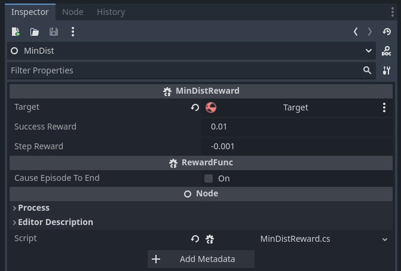
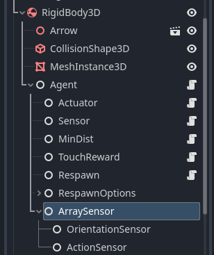
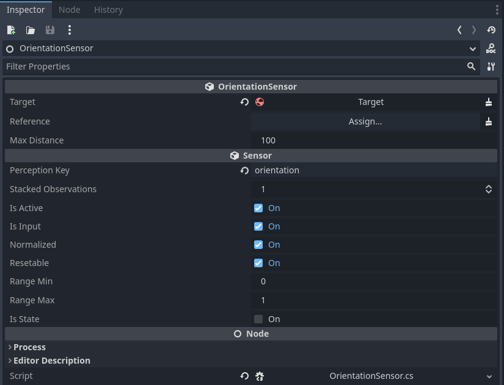
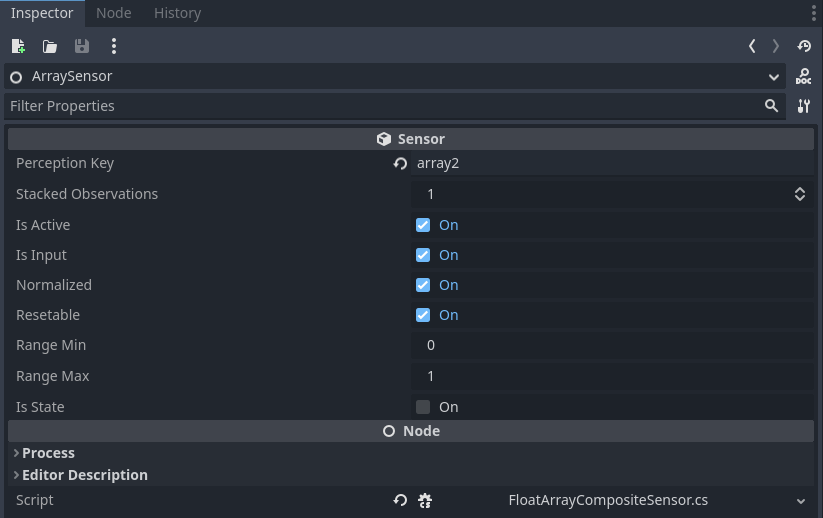
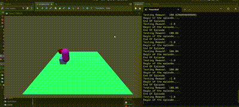

# Introduction

AI4U (Artificial Intelligence for You) is an open tool that brings to Godot an abstraction of behavior modeling based on Artificial Intelligence. The agent abstraction is masterfully used to allow the sharing of solutions. Each component of an agent can be produced, improved, shared, and reused. The components of an agent are: sensors, actuators, behavior functions, a controllable item, and a controller.

The agent sees the game world through sensors. It acts in this world through actuators. The mapping between sensors and actuators is performed by a controller. Based on the history of perceptions, the controller decides which action to execute. Actions change the controllable object of the agent or the surrounding environment.

# How to implement an agent in Godot?

In Godot, an agent is composed of a virtual body, sensors, actuators, and a controller. A virtual body can be an object of type RigidBody2D, RigidBody3D, Node2D, Node3D, or any other object that can be controlled by the user.

> However, for a controllable object to be useful, it is necessary that actuators and sensors can be specifically created for it. For now, we only support RigidBody3D, but any programmer can extend our class library to support other types of objects.

## Installing AI4U
The best way to install AI4U in your project is by downloading the [AI4U](https://github.com/gilzamir18/AI4U) repository on your computer.

Then create a new C# project in Godot (leave the default project creation options).

> For now, AI4U only runs 3D projects.

Copy the **assets** directory from the AI4U repository to your project. This is enough for Godot to recognize the classes you need to model an agent. But to train this agent using reinforcement learning, you need to download and install the [bemaker](https://github.com/gilzamir18/bemaker) utility. This repository allows you to connect your agent in Godot with a Python framework that allows training the agent. AI4U and bemaker are specially designed to communicate properly with the [stable-baselines3](https://github.com/DLR-RM/stable-baselines3) framework.

Once you have installed AI4U, **bemaker**, **stable-baselines3**, continue reading this tutorial.

# The Structure of an Agent in Godot

In Godot, the structure of an agent is a tree of nodes whose root is the object controllable (the body of the agent) by the agent. This structure has small variations, depending on the controllable object.

## Creating a rigid body agent
Let's now modify your project to create an agent with a rigid body. I created a project called [Demo1](https://1drv.ms/u/s!AkkX5pv0cl3aieYYTQz_d9S1kVhJAQ?e=rlCgnh). You need to create a scene where our agent will live and interact with objects. For now, let's create a very simple scene. For this, choose the *3D Scene* option, as shown in *Figure 1*. Use the CTRL+S shortcut to save the scene, as shown in *Figure 2*.


*Figure 1. The scene creation options are shown in the upper left panel.*


*Figure 2. Saving a scene.*

So far, I assume that you have already copied the *assets* directory from the AI4U repository into your project. If so, your project should look like Figure 3.


*Figure 3. Project with AI4U assets.*

Now let's create the scene. The scene consists of a flat floor with a box and an agent (represented by a capsule) on the floor. The agent can move around in the scene and its goal is to approach and touch the box. The agent earns a reward every time it approaches the box and a larger reward when it touches it. The episode ends when the agent touches the box, so touching should generate a high reward. The agent is penalized when it falls from the plane that represents the terrain. In this case, the episode also ends.

We will model the terrain as a plane. To do this, create an object of type *StaticBody3D* as a child of Node3D (the root node of the scene). An object of type *StaticBody3D* also has to have as a child an object of type *CollisionShape* or type *CollisionPolygon3D*. We will use *CollisionShape3D*. And then, in the *Shape* resource of this object, create a *Shape* of type *BoxShape3D*, with the parameters of the *Size* property modified with *x=10m*, *y=0.1m*, and *z=10m*. Also add as a child of *StaticBody3D* an object of type *MeshInstance3D*, which represents the visual mesh of the scene floor. Change the x, y, and z parameters of the *Scale* property to *x=10*, *y=0.1*, and *z=10*. Figure 4 shows these settings made.

# The Structure of an Agent in Godot

In Godot, the structure of an agent is a tree of nodes whose root is the controllable object (the agent's body). This structure has small variations, depending on the controllable object.

## Creating a Rigid Body Agent
Let's now modify your project to create a rigid body agent. I created a project called [Demo1](https://1drv.ms/u/s!AkkX5pv0cl3aieYYTQz_d9S1kVhJAQ?e=rlCgnh). You need to create a scene where our agent will live and interact with objects. For now, let's create a very simple scene. For this, choose the *3D Scene* option, as shown in *Figure 1*. Use the CTRL+S shortcut to save the scene, as shown in *Figure 2*.


*Figure 1. The scene creation options are shown in the upper left panel.*


*Figure 2. Saving a scene.*

So far, I assume that you have already copied the *assets* directory from the AI4U repository into your project. If so, your project should look like Figure 3.


*Figure 3. Project with AI4U assets.*

Now let's create the scene. The scene consists of a flat floor with a box and an agent (represented by a capsule) on the floor. The agent can move around in the scene and its goal is to approach and touch the box. The agent earns a reward every time it approaches the box and a larger reward when it touches it. The episode ends when the agent touches the box, so touching should generate a high reward. The agent is penalized when it falls from the plane that represents the terrain. In this case, the episode also ends.

We will model the terrain as a plane. To do this, create an object of type *StaticBody3D* as a child of Node3D (the root node of the scene). An object of type *StaticBody3D* also has to have as a child an object of type *CollisionShape* or type *CollisionPolygon3D*. We will use *CollisionShape3D*. And then, in the *Shape* resource of this object, create a *Shape* of type *BoxShape3D*, with the parameters of the *Size* property modified with *x=10m*, *y=0.1m*, and *z=10m*. Also add as a child of *StaticBody3D* an object of type *MeshInstance3D*, which represents the visual mesh of the scene floor. Change the x, y, and z parameters of the *Scale* property to *x=10*, *y=0.1*, and *z=10*. Figure 4 shows these settings made.


*Figure 4. Hierarchy of StaticBody3D Object and mesh configuration for this object.*

Now let's create a box that represents our target, the object to be touched. The process of creating this box is very similar to that of the floor, except that at its root we put an object of type RigidBody3D, as shown in Figure 5. The target's CollisionShape3D object should have a shape of type BoxShap3D and a MeshInstance3D with a mesh of type BoxMesh. We can leave these target objects with their default properties, except for RigidBody3D, we move it to the position indicated in Figure 5.


*Figure 5. Hierarchy of RigidBody3D Object and configuration for this object's Transform component.*

These objects will remain fixed in the scene. It is important to rename them at their root so we don't forget what they mean. In StaticBody3D, change its name to Floor; and in RigidBody3D, change its name to Target. Thus, our scene looks like Figure 6.


*Figure 6. Renaming components in the scene.*

Now let's create an agent that learns to approach and touch the target without falling off the plane. To do this, create a node of type RigidBody3D and add a CollisionShape3D and MeshInstance3D as we did for the target, except that Shape and Mesh should be CapsuleShape3D and CapsuleMesh respectively. Position the capsule to be on top of the plane. Also change colors for plane, target and agent objects. This can be done by changing Surface Material Override field from MeshInstance3D for each object. The partial structure for agent is shown in Figure 7.


*Figure 7: Partial version of scene.*


*Figure 8: Partial version of scene with agent's front face being indicated by a red arrow.*

We have finished modeling the environment, but we haven't done much for the agent. The agent needs a main module called BasicAgent, capable of coordinating its sensors and actuators through a controller.

To create a BasicAgent node, create a child node of the RigidBody3D node and change its name to Agent. In the script property of this node, put the BasicAgent script (use the Quick Load property for this). As soon as you add this script, nothing will change in the Inspector. Godot will only show the properties of the added component after a first compilation. First, set the current scene as the main scene of the project. Then click on build to compile the project for the first time. Then execute CTRL+F5. A black screen will open, as there is no camera and no light in the scene. But this first compilation was just for Godot to recognize the properties of the BasicAgent object.

> To compile correctly, you need to create a C# solution. To do this, in the Project menu, select Tools>>C#>>"Create C# Solution". Done, your project can be compiled correctly.

After compiling the project for the first time, the properties of the BasicAgent script will be shown in Godot's *inspector*. Configure these properties as shown in Figure 9.


*Figure 9. Agent settings. The Remote option indicates that the agent will communicate with a remote controller (a Python script). The *Max Steps Per Episode* option indicates the maximum number of time steps per episode.*

Figure 10 shows the current structure of the project.


*Figure 10. Current structure of the agent.*

Our agent is still very simple, without sensors and without actuators. It is necessary to add actuators and sensors to the agent. We will use an actuator of type *RBMoveActuator* sensor and a sensor of type *Raycasting*. Add an actuator of type *RBMoveActuator* with the settings shown in Figure 11.

> Note: observe that whenever we create an AI4U object, we create a generic Node type node. And then we add an AI4U script, like *BasicAgent* and *RBMoveActuator*. From now on, to simplify writing, we will only say: create a node of type *BasicAgent*.


*Figure 11. Agent's actuator.*

In Figure 12, I show the agent's sensor of type *Raycasting*. The continuation of these properties is shown in Figure 13.


*Figure 12. Part of the agent's sensor properties.*


*Figure 13. The other part of the agent's sensor properties.*

Check the values of sensors and actuators and configure them according to the images already shown.

Now we have an agent capable of moving and perceiving the world. But this agent still doesn't have a goal. Let's add goals to the agent through reward functions. Add two more Node type objects as children of the Agent node: one type *MinDistReward* and another type *TouchRewardFunc*. The first gives a reward whenever the agent performs an action that brings it closer to the goal. The second gives a reward when the agent touches the target. Figure 15 shows how MinDist function was configured. Figure 16 shows how TouchReward function was configured.



*Figure 14. Properties of MinDist reward function.*


*Figure 15. Properties of TouchReward reward function.*

Our project is almost ready. We may want the agent to appear in the scene in various random positions. For this, let's add an extra actuator to the agent. This actuator only executes before the beginning of an episode. Create a node of type RBRespawnActuator, as shown in Figure 16. Note that this node contains the property *Respawn Option Path*, which points to a subtree of the scene that contains several Node3D with positions for the agent to respawn. Place some positions that cover the area of ​​the scene.


*Figure 16. Agent's Respawn component.*

We're almost ready to train our agent. We need to create the object that controls the agent's control loop. To do this, create a node of type *ControlRequestor* and add it as a child of the root of the scene.


*Figure 17. Agent's control loop.*

In theory, this agent can already be trained. But there are still some flaws in its design. The agent sees only one frame of the game at a time. We could add more frames through the *Stacked Observations* property, but the agent's training would take a long time. For the agent's behavior to learn, we need to transform the agent's observation into something more informative without greatly increasing its complexity. For this, we developed a set of sensors suitable for making the agent's perceptions more informative. In reinforcement learning jargon, we say that the agent's observations represent a Markovian state for the task to be learned. For this, we use two sensors (see Figure 18): *OrientationSensor* (configured as shown in Figure 19) and *ActionSensor* (configured as shown in Figure 20). These sensors should be created as children of a FloatArrayCompositeSensor node, configured as shown in Figure 21. A composite type sensor groups multiple sensors, making them look like a single sensor to the training algorithm.



*Figure 18. A FloatArrayCompositeSensor type sensor grouping two sensors: OrientationSensor and ActionSensor.*



*Figure 19. Configuration of OrientationSensor.*


*Figure 20. Configuration of ActionSensor.*



*Figure 21. Configuration of FloatArrayCompositeSensor.*

> A small detail has been forgotten so far in creating this environment. It is necessary to create a reward function that ends the episode if the agent falls off the floor. To do this, create a node of type *FallReward* as a child of the Agent node and configure it as shown in Figure 22.


*Figure 22. Reward generated when the episode ends.*

Now we can train our agent. To do this, create a Python file (let's say, train.py) and copy the following content into it:

```Python
import bemaker
from bemaker.controllers import BasicGymController
import BMEnv
import gymnasium as gym
import numpy as np
from stable_baselines3 import SAC
from stable_baselines3.sac import MultiInputPolicy

env = gym.make("BMEnv-v0")

model = SAC(MultiInputPolicy, env, verbose=1, tensorboard_log="SAC")
print("Training....")
model.learn(total_timesteps=20000, log_interval=4,  tb_log_name='SAC')
model.save("sac_bemaker")
print("Trained...")
del model # remove to demonstrate saving and loading
print("Train finished!!!")
```

Ensure that all necessary modules are installed (bemaker, pytorch, stable-baselines3, and gymnasium). Now, run the Python program:


```sh
$> python train.py
```

Observe the agent's behavior at the start of training, it moves strangely on the plane and not as if it were moving. To correct this, close the game window in Godot. Now, go to the RigidBody3D node of the agent and modify the *Axis Lock* property as shown in *Figure 23*.


*Figure 23. Axis Lock configuration of the agent's RigidBody3D.*

> Final Adjustments: In the RigidBody3D of all objects that can collide, enable the *Contact Monitor* property. Also, change the *Max Contacts Reported* property to a value greater than zero (I used 10000). These changes are essential for the proper functioning of the *TouchRewardFunc*. For greater physics calculation accuracy, enable the *Continuos CD* properties of the agent's RigidBody3D. Specifically for the RigidBody3D of the target (Target object), enable the *Freeze* and *Lock Rotation* properties. Specifically for the agent's RigidBody3D, change the *Damp* property, from the *Angular* tab to 5. This property is essential to obtain a smooth rotation of the agent's body.

After running the training script, you should observe something like shown in Figure 24.


*Figure 24. Agent training.*

After approximately 16 thousand steps of updating the agent's neural network, the result is as shown in Figure 25.


*Figure 25. Several steps after start of agent training.*

After training the agent, a file *sac_bemaker.zip* is generated. This file contains the neural network model that knows how to control the agent to perform a task. We can run this model using a Python loop or using the model directly in Godot itself. To use Python, create a test file with the following content:

```Python
from bemaker.controllers import BasicGymController
import BMEnv
import  gymnasium  as gym
import numpy as np
from stable_baselines3 import SAC
from stable_baselines3.sac import MultiInputPolicy

env = gym.make("BMEnv-v0")

model = SAC.load("sac_bemaker")

obs, info = env.reset()

reward_sum = 0
while True:
    action, _states = model.predict(obs, deterministic=True)
    obs, reward, done, truncated, info = env.step(action)
    reward_sum += reward
    env.render()
    if done:
      print("Testing Reward: ", reward_sum)
      reward_sum = 0
      obs, info = env.reset()
```
Now run the file with the following command:

```sh
$> python test.py
```

Run the scene and see the result.

> Change the execution speed of the *ControlRequestor* by changing the value of *Default Time Scale* to 1.

In the document [Introduction to ONNX Model](introductionwithonnxmodels.md), I show how to run the model directly in Godot, without needing to use Python.



*Figure 26. Agent after training.*

Note that in the directory where you ran the training script, a directory named SAC was created. This directory creates tensorboard log files for you to check the progress of training in graphs. In the Linux/Window terminal, access the SAC directory and type the command:

```
python -m tensorboard.main --logdir .
```

or

```
python -m tensorboard.main --port 6007 --logdir .
```

Then, open the link suggested by tensorboard in a browser (usually *http://localhost:6006*). The results may be as shown in Figure 27.


*Figure 27. Final result of training.*

