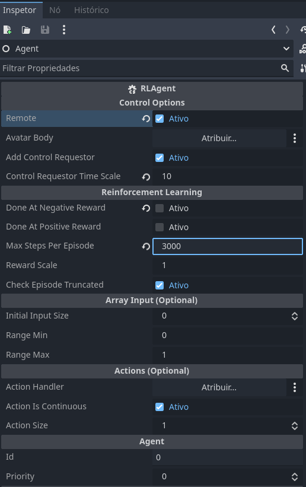
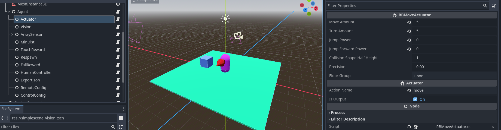
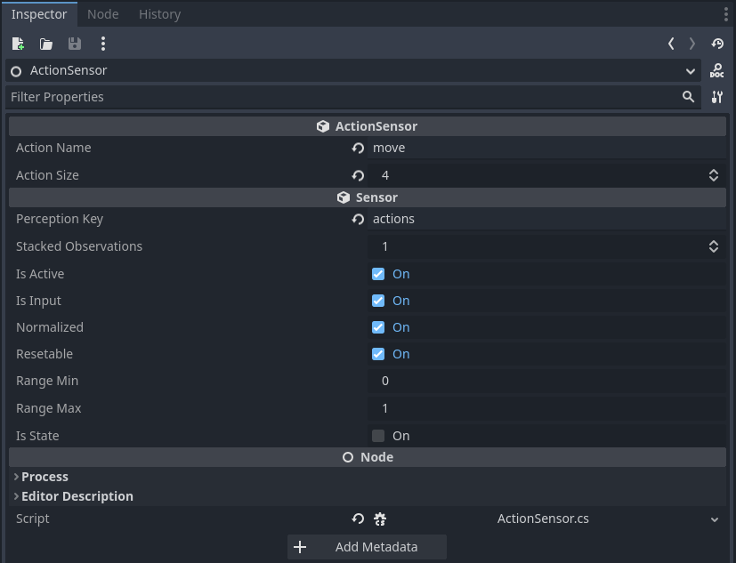
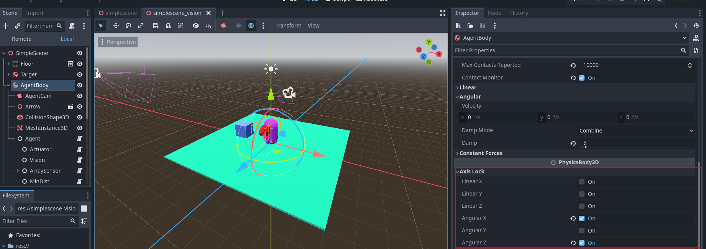
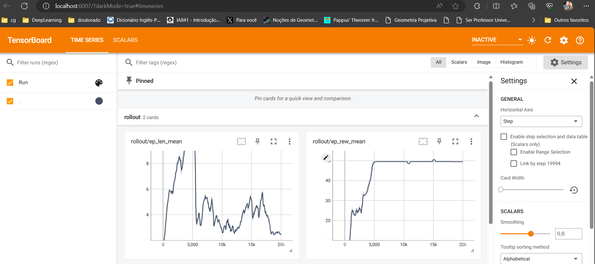

# Introduction

[Summary](summary.md)

AI4U (Artificial Intelligence for You) is an open tool that brings AI-based behavior modeling abstraction to Godot. The agent abstraction is used to enable solution sharing. Each component of an agent can be produced, improved, shared, and reused. The components of an agent are: sensors, actuators, reward functions, a controllable item, and a controller.

The agent perceives the game world through sensors and acts upon it through actuators. The mapping between sensors and actuators is carried out by a controller. Based on the perception history, the controller decides which action to execute. Actions change either the controllable object of the agent or the surrounding environment.

This tutorial is entirely based on Godot version 4.2.1 (mono or .NET). The [official Godot documentation on using C#](https://docs.godotengine.org/en/stable/tutorials/scripting/c_sharp/c_sharp_basics.html) is a good starting point to fully understand this tutorial.

# How to Implement an Agent in Godot?

In Godot, an agent is composed of a virtual body, sensors, actuators, and a controller. A virtual body can be an object of type RigidBody2D, CharacterBody2D, RigidBody3D, CharacterBody3D, Node2D, Node3D, or any other object that the agent can control.

> However, for a controllable object to be useful, actuators and sensors must be specifically created for it. Currently, we only support RigidBody3D, but any programmer can extend our class library to support other types of objects.

## Installing AI4U
The best way to install AI4U in your project is by downloading the [AI4U repository](https://github.com/gilzamir18/AI4U) to your computer.

Then, create a new C# project in Godot (leave the default project creation options).

Copy the **addons/ai4u** directory from the AI4U repository to your project. This is enough for Godot to recognize the classes you need to model an agent. But, to train this agent using reinforcement learning, it is necessary to copy the [*AI4U/pyplugin*](https://github.com/gilzamir18/ai4u) directory. This plugin allows you to connect your agent in Godot with a Python framework that enables agent training. AI4U and the *pyplugin* are specially designed to communicate properly with the [stable-baselines3](https://github.com/DLR-RM/stable-baselines3) framework.

Once you have installed AI4U, the pyplugin, and **stable-baselines3**, continue reading this tutorial.

# The Structure of an Agent in Godot

In Godot, the structure of an agent is a node tree whose root is the controllable object (the agent's body). This structure has small variations depending on the controllable object.

## Creating a Rigid Body Agent
Now let's modify your project to create a rigid body agent. Create a project named [Demo1](https://1drv.ms/u/s!AkkX5pv0cl3aieYYTQz_d9S1kVhJAQ?e=rlCgnh). You need to create a scene where our agent will live and interact with objects. For now, let's create a very simple scene. To do this, choose the *3D Scene* option, as shown in *Figure 1*. Use the CTRL+S shortcut to save the scene, as shown in *Figure 2*.


*Figure 1. The scene creation options are shown in the upper left panel.*


*Figure 2. Saving a scene.*

So far, I assume you have already copied the *addon/ai4u* directory from the AI4U repository to your project. If so, your project should look like the one shown in Figure 3.


*Figure 3. Project with AI4U assets.*

Now let's create the scene. The scene consists of a flat floor with a box and an agent (represented by a capsule) on the floor. The agent can move around the scene and aims to approach and touch the box. The agent gains a reward every time it gets closer to the box and a higher reward when it touches it. The episode ends when the agent touches the box, so the touch should generate a high reward. The agent is penalized when it falls off the plane that represents the ground. In this case, the episode also ends.

Let's model the ground as a plane. To do this, create a *StaticBody3D* object as a child of Node3D (the root node of the scene). A *StaticBody3D* object also needs to have a *CollisionShape* or a *CollisionPolygon3D* child object. We will use *CollisionShape3D*. Then, in the *Shape* resource of this object, create a *BoxShape3D* shape, with the *Size* property parameters modified to *x=10m*, *y=0.1m*, and *z=10m*. Also, add a *MeshInstance3D* object as a child of *StaticBody3D*, representing the visual mesh of the ground of the scene. Change the x, y, and z parameters of the *Scale* property to *x=10*, *y=0.1*, and *z=10*. Figure 4 shows these configurations.


*Figure 4. StaticBody3D Object hierarchy and mesh configuration.*

Now let's create a box that represents our target, the object to be touched. The creation process for this box is very similar to that of the floor, except that at the root we place a RigidBody3D object, as shown in Figure 5. The target's *CollisionShape3D* object should have a BoxShape3D *shape* and a *MeshInstance3D* with a *BoxMesh* mesh. We can leave these target objects with their default properties, except for the RigidBody3D, which we move to the position indicated in *Figure 5*.


*Figure 5. RigidBody3D Object hierarchy and Transform component configuration.*

These objects will remain fixed in the scene. It is important to rename them at the root so we don't forget what they mean. Rename the *StaticBody3D* to *Floor*; and the *RigidBody3D* to *Target*. Thus, our scene looks like the one shown in *Figure 6*.


*Figure 6. Renaming the scene components.*

Now let's create an agent that learns to approach and touch the target without falling off the plane. To do this, create a RigidBody3D node and add a CollisionShape3D and a MeshInstance3D as we did for the target, except that the Shape and Mesh should be CapsuleShape3D and CapsuleMesh, respectively. Position the capsule to be on the plane. Additionally, change the colors of the plane, target, and agent. This can be done by changing the *Surface Material Override* field of each object's *MeshInstance3D*. The partial structure of the agent is shown in *Figure 7*. Note that the agent, as a 3D object, should have a front-facing direction. In Godot, we use the z-axis to indicate the front direction of a 3D object. However, this axis is not visible, and when the agent is moving in the scene, we won't know which side is the front, as the cylinder is symmetrical in a given direction. To resolve this, in *addons/ai4u/3DModel*, select the Arrow.dae model and drag it as a child of RigidBody3D. Adjust the dimensions and orientation of the arrow to look like the one shown in Figure 8.


*Figure 7. Partial scene version.*


*Figure 8. Partial scene version with the agent's front face indicated by a red arrow.*

We have finished modeling the environment, but we haven't done much for the agent yet. The agent needs a main module called *BasicAgent*, capable of coordinating its sensors and actuators through a controller.

To create a *BasicAgent* node, create a child node of the RigidBody3D node and rename it to *Agent*. In the *script* property of this node, set the *BasicAgent* script (use the *Quick Load* property for this). As soon as you add this script, nothing will change in the *Inspector*. Godot will only show the properties of the added component after the first compilation. First, set the current scene as the main project scene. Then, click *build* to compile the project for the first time. After that, run CTRL+F5. A black screen will open because there is no camera or light in the scene. But this first compilation was just for Godot to recognize the properties of the *BasicAgent* object.

> For the compilation to work correctly, it is necessary to create a C# solution. To do this, in the Project menu, select Tools >> C# >> "Create C# Solution". Now your project can be compiled correctly.

After compiling the project for the first time, the BasicAgent script properties will be shown in Godot's *inspector*. Configure these properties as shown in Figure 9.



*Figure 9. Agent configurations. The Remote option

 indicates that the agent will communicate with a remote controller (a Python script). When remote is unchecked, you have to use either the NeuralNetController (to load a neural network directly in Godot) or a WASDMoveActuator combined with RBMoveActuator or RBMoveActuator2D (to control the agent directly using the W, A, S, D, J, and U keys). The last option is excellent for testing the game physics before training the agent. The *Max Steps Per Episode* option indicates the maximum time steps of an episode.*

Figure 10 shows the current project structure.


*Figure 10. Current agent structure.*

Our agent is still very simple, without sensors or actuators. It is necessary to add actuators and sensors to the agent. Let's use an actuator of the *RBMoveActuator* type sensor and a sensor of the *Raycasting* type. Add an *RBMoveActuator* actuator with the settings shown in *Figure 11*.

> Note: observe that whenever we create an AI4U object, we create a generic Node. Then we add an AI4U script, such as *BasicAgent* and *RBMoveActuator*. From now on, to simplify writing, we will just say: create a *BasicAgent* node.



*Figure 11. Agent actuator.*

In Figure 12, I show the agent's *Raycasting* type sensor. The continuation of these properties is shown in Figure 13.


*Figure 12. Part of the agent's sensor properties.*


*Figure 13. The other part of the agent's sensor properties.*

Check the sensor and actuator values and configure them as shown in the images already shown.

Now we have an agent capable of moving and perceiving the world. But this agent still has no objective. Let's add objectives to the agent through reward functions. Add two more Node objects as children of the Agent node: one of type *MinDistReward* and the other of type *TouchRewardFunc*. The first gives a reward whenever the agent performs an action that brings it closer to the target. The second gives a reward when the agent touches the target. *Figure 14* shows how the MinDist function was configured. *Figure 15* shows how the *TouchReward* function was configured.


*Figure 14. MinDist reward function properties.*


*Figure 15. TouchReward function properties.*

Our project is almost ready. We might want the agent to appear in the scene at various random positions. To do this, let's add an extra actuator to the agent. This actuator only executes before the start of an episode. Create a node of type RBRespawnActuator, as shown in Figure 16. Note that this node contains the *Respawn Option Path* property, which points to a scene subtree containing several Node3D with positions for the agent to respawn. Place some positions that cover the scene area.


*Figure 16. Agent's Respawn component.*

We are close to training our agent. We need to create the object that controls the agent's control loop. To do this, create a node of type *ControlRequestor* and add it as a child of the scene root.


*Figure 17. Agent's control loop.*

In theory, this agent can already be trained. But there are still some flaws in your project. The agent sees only one frame of the game at a time. We could add more frames through the *Stacked Observations* property, but the agent's training would take a long time. For the agent's behavior to learn, we need to make the agent's observation more informative without increasing its complexity much. For this, we developed a set of sensors suitable for making the agent's perceptions more informative. In reinforcement learning jargon, we say that the agent's observations represent a Markovian state for the task to be learned. For this, we use two sensors (see in *Figure 18*): *OrientationSensor* (configured as shown in *Figure 19*) and *ActionSensor* (configured as shown in *Figure 20*). These sensors should be created as children of a FloatArrayCompositeSensor node, configured as shown in *Figure 21*. A *composite* sensor groups multiple sensors, making them appear to the training algorithm as a single sensor.


*Figure 18. A FloatArrayCompositeSensor grouping two sensors: OrientationSensor and ActionSensor.*


*Figure 19. OrientationSensor configuration.*



*Figure 20. ActionSensor configuration.*


*Figure 21. FloatArrayCompositeSensor configuration.*

> A small detail was forgotten until now in creating this environment. It is necessary to create a reward function that ends the episode if the agent falls off the floor. To do this, create a *FallReward* node as a child of the Agent node and configure it as shown in *Figure 22*.


*Figure 22. Reward generated when the episode ends.*

Now we can train our agent. To do this, create a Python file (let's say, train.py) and copy the following content into it:

```Python
import gymnasium as gym
import numpy as np
from stable_baselines3 import SAC
from stable_baselines3.sac import MultiInputPolicy
import ai4u
from ai4u.controllers import BasicGymController
import AI4UEnv
import gymnasium as gym

env = gym.make("AI4U-v0")

model = SAC(MultiInputPolicy, env, verbose=1, tensorboard_log="SAC")
print("Training....")
model.learn(total_timesteps=20000, log_interval=4, tb_log_name='SAC')
model.save("mymodel")
print("Trained...")
del model  # remove to demonstrate saving and loading
print("Train finished!!!")
```

Ensure all the necessary modules are installed (bemaker, pytorch, stable-baselines3, and gymnasium). Now, run the Python program:

```sh
$> python train.py
```

Observe the agent's behavior at the beginning of the training; it moves strangely on the plane. To fix this, close the game window in Godot. Now, go to the agent's RigidBody3D node and modify the *Axis Lock* property as shown in *Figure 23*.



*Figure 23. Agent's RigidBody3D Axis Lock configuration.*

> Final Adjustments: In the RigidBody3D of all objects that can collide, enable the *Contact Monitor* property. Also, change the *Max Contacts Reported* property to a value greater than zero (I used 10000). These changes are essential for the proper functioning of the *TouchRewardFunc*. For greater physics calculation accuracy, enable the *Continuous CD* property of the agent's RigidBody3D. Specifically for the target's RigidBody3D (Target object), enable the *Freeze* and *Lock Rotation* properties. Specifically for the agent's RigidBody3D, change the *Damp* property in the *Angular* tab to 5. This property is essential for achieving smooth rotation of the agent's body.

After running the training script, you should see something like the one shown in *Figure 24*.


*Figure 24. Agent training.*

After approximately 16,000 update steps of the agent's neural network, the result is as shown in *Figure 25*.


*Figure 25. Several steps after the start of the agent's training.*

After training the agent, a *sac_bemaker.zip* file is generated. This file contains the neural network model that knows how to control the agent to perform a task. We can run this model using a Python loop or use the model directly in Godot. To use Python, create a test file with the following content:

```Python
import gymnasium as gym
import numpy as np
from stable_baselines3 import SAC
from stable_baselines3.sac import MultiInputPolicy
import ai4u
from ai4u.controllers import BasicGymController
from ai4u.onnxutils import sac_export_to
import AI4UEnv
import gymnasium as gym

env = gym.make("AI4U-v0")

print('''
AI4U Client Controller
=======================
This example controls a movable character in-game.
''')
model = SAC.load("ai4u_model")

sac_export_to("ai4u_model", metadatamodel=env.controller.metadataobj)

obs, info = env.reset()
reward_sum = 0
while True:
    action, _states = model.predict(obs, deterministic=True)
    obs, reward, done, truncated, info = env.step(action)
    reward_sum += reward
    env.render()
    if done:
        print("Testing Reward: ", reward_sum)
        reward_sum = 0
        obs, info = env.reset()
```

Now run the file with the following command:

```sh
$> python test.py
```

Run the scene and see the result.

> Change the execution speed of the *ControlRequestor* by changing the *Default Time Scale* value to 1.

In the document [Introduction to

 ONNX Model](introductionwithonnxmodels.md), I show how to run the model directly in Godot, without needing to use Python.


*Figure 26. Agent after training.*

Notice that in the directory where you ran the training script, a directory named SAC was created. This directory creates tensorboard log files for you to check the training progress in graphs. In the Linux/Windows terminal, access the SAC directory and type the command:

```
python -m tensorboard.main --logdir .
```

or

```
python -m tensorboard.main --port 6007 --logdir .
```

Then open the link suggested by tensorboard in a browser (usually *http://localhost:6006*). The results may look like those shown in *Figure 27*.



*Figure 27. Final training result.*
