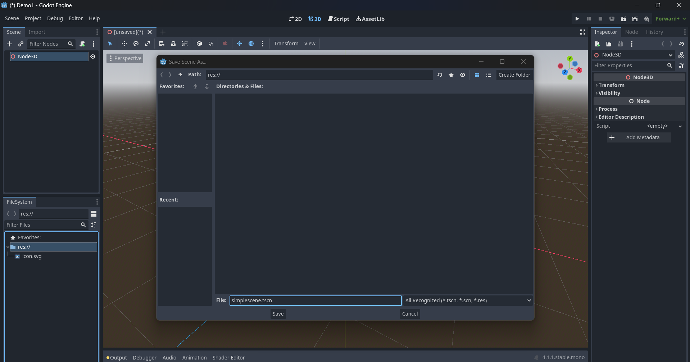
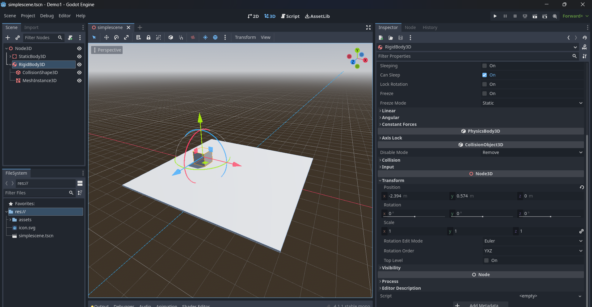
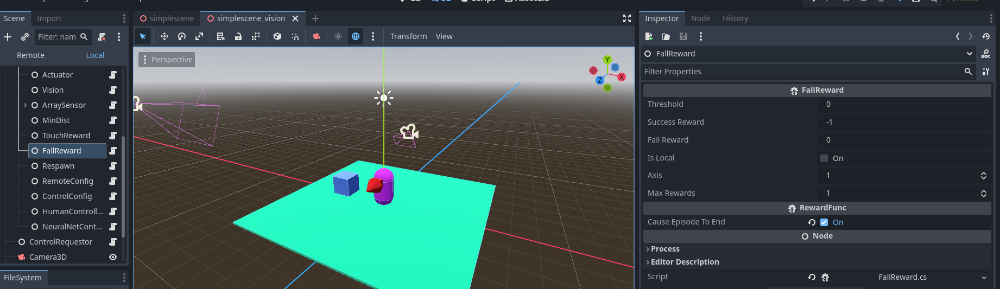
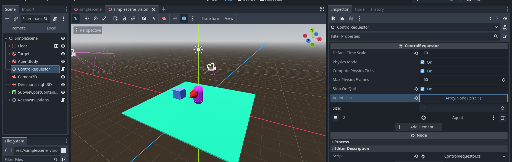
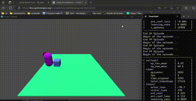

# Introdução

AI4U (Artificial Intelligence for You) é uma ferramenta aberta que traz para a Godot uma abstração de modelagem de comportamentos baseada em Inteligência Artificial. A abstração de agente é usada de maneira a permitir o compartilhamento de soluções. Cada componente de um agente pode ser produzido, aperfeiçoado, compartilhado e reaproveitado. Os componentes de um agente são: sensores, atuadores, funções de recompensa, um item controlável e um controlador.

O agente enxerga o mundo do jogo por meio de sensores e atua neste mundo por meio de atuadores. O mapeamento entre sensores e atuadores é realizado por um controlador. Com base no histórico de observaçõesss, o controlador decide qual ação executar. As ações alteram o objeto controlável do agente ou o ambiente ao redor.

Este tutorial se baseia inteiramente na versão 4.2.2 da Godot (.NET version). A [documentação oficial da Godot sobre o uso de C#](https://docs.godotengine.org/en/stable/tutorials/scripting/c_sharp/c_sharp_basics.html) é um bom ponto-de-partida para compreender este tutorial completamente.

# Como implementar um agente na Godot?

Em Godot, um agente é composto por um corpo virtual, sensores, atuadores e um controlador. Um corpo virtual pode ser um objeto do tipo RigidBody2D, CharacterBody2D, RigidBody3D, CharacterBody3D, Node2D, Node3D, ou qualquer outro objeto que o agente tenha controle sobre.

> Contudo, para que um objeto controlável seja útil, é necessário que atuadores e sensores possam ser criados especificamente para ele. Por enquanto, estes são os sensores e atuadores implementados e os tipos de corpos que suportam:


|    Atuador/Sensor/Controlador |          Role          |     Type            |
| ----------------------------- | ---------------------- | ---------------- |
|       CBMoveActuator          |         Atuador        | CharacterBody3D  |
|       RBMoveActuator          |         Atuador        |   RigidyBody3D   |
|       RBMoveActuator2D        |         Atuador        |   RigidyBody2D   |
|       RBRespawnActuator*      |         Atuador        |   RigidyBody3D   |
|       CBRespawnActuator*      |         Atuador        | CharacterBody3D  |
|       DiscretActuator         |         Atuador        |   Node2D/Node3D  |
|       Camera3DSensor***       |         Sensor         |      Node3D      |
|       ActionSensor            |         Sensor         |   Node2D/Node3D  |
|     LinearRayRaycasting***    |         Sensor         |   Node3D         |
|     OrientationSensor***      |         Sensor         |   Node3D         |
|     RewardSensor              |         Sensor         |   Node2D/Node3D  |
|     ScreenSensor              |         Sensor         |   Node2D/Node3D  |
|    GroundStatusSensor***      |         Sensor         |   Node3D         |
| ArrowPhysicsMoveController*** |         Controller     |   Node3D         |
| DiscretArrowController        |         Controller     |   Node2D/Node3D  |


\* Estes atuadores são usados apenas para posicionar o agente em alguma parte da cena no início de um episódio.

\*\* Pode ser qualquer objeto do tipo Node2D ou Node3D ou de qualquer subtipo destes. O objeto deve suportar a mensagem **SetAction(action)** que recebe o argumento **action**, um inteiro maior ou igual a zero. 

\*\*\* Estes ensores podem ser aplicados a qualquer Node3D suportado (no caso, RigidBody3D e CharacterBody3D).


## Instalando a AI4U
A melhor forma de instalar a AI4U em seu projeto é baixando em seu computador o respositório [AI4U](https://github.com/gilzamir18/AI4U). 

Então, crie um novo projeto C# na Godot (deixe as opções padrões de criação de projeto).

Copie o diretório **addons** do repositório AI4U para o seu projeto. Isto é o suficiente para a Godot reconhecer as classes que você precisa para modelar um agente. Mas, para treinar este agente usando aprendizagem por reforço, é necessário instalar o componente [*AI4U/pyplugin*](https://github.com/gilzamir18/ai4u). Este plugin permite você conectar o seu agente na Godot com um framework Python, o que permite treinar o agente. A AI4U é o *pypluing* foram  especialmente projetados para se comunicarem adequadamente com o framework [stable-baselines3](https://github.com/DLR-RM/stable-baselines3).

Uma vez que você tenha instalado AI4U, pyplugin e **stable-baselines3**, continue lendo este tutorial.

# Um Exemplo Básico

Na Godot, a estrutura de um agente é uma árvore de nós cuja raiz é o objeto controlável (o corpo do agente) pelo agente. Essa estrutura possui pequenas variações, a depender do objeto controlável.

## Criando um agente de corpo rígido
Vamos agora modificar o seu projeto para criarmos um agente com corpo rígido. Crie um projeto denominado [BoxChase](https://github.com/gilzamir18/ai4u_demo_projects/tree/main/BoxChase). É preciso criar uma cena onde nosso agente vai viver e interagir com objetos. Por enquanto, vamos criar uma cena muito simples. Para isso, escolha a opção *3D Scene*, como mostrado na *Figura 1*. Execute o atalho CTRL+S para salvar a cena, como mostrado na *Figura 2*.


*Figure 1. As opções de criação de cena são mostradas no painel superior esquerdo.*



*Figure 2. Salvando uma cena.*

Até aqui, suponho que você já copiou o diretório *addons* do repositório AI4U em seu projeto. Se sim, seu projeto deveria estar como mostrado na Figura 3.


*Figure 3. Projeto com assets da AI4U.*

## Criando o Ambiente

Agora vamos criar a cena. A cena é composta de um piso plano com uma caixa e um agente (representado por uma capsula) sobre o piso. O agente pode se movimentar na cena e tem como objetivo se aproximar e tocar a caixa. O agente ganha uma recompensa toda vez que se aproxima da caixa e uma recompensa maior quando a toca. O episódio termina quando o agente toca a caixa, por isso, o toque deve gerar uma alta recompensa. O agente é penalizado quando cai do plano que representa o terreno. Neste caso, o  episódio também termina.

Vamos modelar o terremo como um plano. Para isso, crie um objeto do tipo *StaticBody3D* como filho de Node3D (o nó raiz da cena). Um objeto do tipo *StaticBody3D* também tem que ter como filho um objeto do tipo *CollisionShape* ou do tipo *CollisionPolygon3D*. Vamos usar *CollisionShape3D*. E então, no recurso *Shape* deste objeto, crie uma *Shape* do tipo *BoxShape3D*, com os parâmetros da propriedade *Size* modificados com *x=10m*, *y=0.1m* e *z=10m*. Também adicione  como filho do *StaticBody3D* um objeto do tipo *MeshInstance3D*, que representa a malha visual do chão da cena. Altere os parâmetros x, y e z da propriedade *Scale* para *x=10*, *y=0.1* e *z=10*. A Figura 4 mostra estas configurações realizadas.


*Figure 4. Hierarquia do Objeto StaticBody3D e configuração da malha deste objeto.*

Agora vamos criar uma caixa que representa o nosso alvo, o objeto a ser tocado. O processo de criação dessa caixa é muito parecido com o do piso, exceto que na raiz colocamos um objeto do tipo RigidBody3D, como mostra a Figura 5. O objeto *CollisionShape3D* do alvo deve ter um *shape* do tipo BoxShap3D e um *MeshInstance3D* com um *mesh* do tipo *BoxMesh*. Podemos deixar estes objetos do alvo com suas propriedades padrões, execto o RigidBody3D, movemos para a posição indicada na *Figura 5*.



*Figure 5. Hierarquia do Objeto RigidBody3D e configuração do componente Transform deste objeto.*

Estes objetos ficarão fixos na cena. Altere o nome do nó  *StaticBody3D* para *Floor*; e no *RigidBody3D*, altere o nome para Target. Assim, nossa cena fica como mostrada na *Figura 6*.


*Figure 6. Renomeação dos componentes da cena.*

## Estrutura do Agente 

Agora vamos criar um agente que aprende a se aproximar e a tocar o alvo sem cair do plano. Para isso, crie um nó do tipo RigidBody3D e adicione uma CollisionShape3D e uma MeshInstance3D como fizemos no caso do alvo, exceto que a Shape e a Mesh devem ser do tipo CapsuleShape3D e MeshInstance3D (com Mesh configurada para ser uma capsula), respectivamente. Posicione a capsula para ficar sobre o plano. Além disso, mude as cores do plano, do alvo e do agente. Isso pode ser feito alterando o campo *Surface Material Override* do *MeshInstance3D* de cada objeto. A estrutura parcial do agente é mostrada na *Figura 7*. 


*Figure 7. Versão parcial da cena.*


Observe que o agente como um objeto 3D deveria ter uma direção frontal. Na Godot, usamos o eixo z para indicar a direção frontal de um objeto 3D. Contudo, este eixo não fica visível e, quando o agente estiver se movimentando na cena, não saberemos qual o seu lado da frente, pois a capsula é simétrica. Para resolvermos isso, em *assets/3DModel*, selecione o modelo Arrow.dae e o arraste como filho de RigidBody3D. Altere as dimensões e a orientação da seta para ficar como mostrado na Figura 8.


*Figure 8. Versão parcial da cena com face frontal do agente sendo indicada por uma seta vermelha.*

Concluímos o corpo físico e a aparência do agente, mas ainda não fizemos muito sobre como o agente percebe o ambiente e age sobre este mundo. Mas antes de fazermos isso, vamos mudar o nome do nó RigidBody3D para AgentBody, assim saberemos que se trata do agente.

O agente precisa de um módulo principal chamado *BasicAgent*, capaz de coordenar seus sensores e atuadores por meio de um controlador. 

Para criar um nó *BasicAgent*, crie um nó filho do nó AgentBody e mude o seu nome para *Agent*. Na propriedade *script* deste nó, coloque o script *BasicAgent* (use a propriedade *Quick Load* para isso). Assim que adicionar este script, nada mudará no *Inspector*. A Godot apenas mostrará as propriedades do componente adicionado depois de uma nova compilação. Portanto, configure a cena atual como cena princpal do projeto. Então, clique em *build* para compilar o projeto pela primeira vez. Depois, execute CTRL+F5. Será aberta uma tela preta, pois não tem nenhuma câmera e nenhuma luz na cena. Mas esta primeira compilação foi apenas para Godot reconhecer as propriedades do objeto *BasicAgent*.

> Para a compilação funcionar corretamente, é necessário criar uma solução C#. Para isso, no menu Project, selecione Tools>>C#>>"Create C# Solution". Pronto, seu projeto pode ser compilado corretamente.

Depois de compilar o projeto pela primeira vez, as propriedades do script BasicAgent serão mostradas no *inspector* da Godot. Configure estas propriedades como mostrado na Figura 9.


*Figure 9. Configurações do agente. A opção Remote indica que o agente vai se comunicar com um controlador remoto (um script em Python). Quando remote estiver desmarcado, você tem que usar ou o NeuralNetController (para carregar uma rede neural diretamente na Godot) ou um ArrayPhysicsMoveActuator combinado com RBMoveActuator ou RBMoveActuator2D  (para controlar o agente diretamente por meio das teclas de setas). A última opção é excelente para testar a física do jogo antes de treinar o agente. Já a opção *Max Steps Per Episode* indica a quantidade de passos (de tempo) máxima de um episódio.*

A Figura 10 mosta a estrutura atual do projeto.


*Figure 10. Estrutura atual do projeto.*

O nosso agente ainda está muito simples, sem sensores e sem atuadores. É necessário se adicionar atuadores e sensores para o agente. Vamos utilizar um um atuador do tipo *RBMoveActuator* e um sensor do tipo *Camera3DSensor*. Adicione um atuador do tipo *RBMoveActuator* como filho do nó **Agent** com as configurações mostradas na *Figura 11*. Aproveite e crie a estrutura de nós mostrado na *Figura 11*. Para criar os nós filhos de **Agent**, clique com o botão direito neste nó e selecione a opção que leva à criação de um novo nó. Selecione a opção genérica Node e a modifique o nome deste nó para um dos nomes mostrados na *Figura 11*, abaixo de *Agent*. Então, sob 

> Nota: observe que sempre que criamos um objeto da AI4U, criamos um nó do tipo genérico Node. E então adicionamos um script da AI4U, como *BasicAgent* e *RBMoveActuator*. De agora em diante, para simplificar a escrita, diremos apenas: crie um nó do tipo *BasicAgent*.


*Figure 11. Atuador do agente.*

Na Figura 12, mostro o nó nomeado Vision contendo um script do tipo *Camera3DSensor*.


*Figure 12. Propriedades do sensor Vision do agente, que produzirá uma sequência de 3 imagens tem tons de cinza com resolução de 61x61 pixels cada imagem.*

O sensor *Vision* é do tipo que permite ao agente visualizar o mundo do ponto de vista de uma câmera do tipo Camera3D colocada na cena. Colocamos essa câmera como filha do nó *AgentBody*. Dessa forma sempre que o agente girar, a câmera gira a visão do agente. Observe que a propriedade *Camera* do Camera3DSensor aponta justamente para um objeto nomeado AgentCam, que é um objeto do tipo Camera3D, como mostrado na *Figura 13*. 


*Figure 13. Câmera do agente.*

Finalmente, a cada passo de simulação, o sensor de visão  produzirá uma sequência de 3 imagens tem tons de cinza com resolução de 61x61 pixels cada imagem. Mas, para o agente aprender efetivamente, é necessário ele perceber as próprias ações e ter uma informação direta de sua orientação espacial em relação ao alvo (o cubo a ser caçado). Para isso, vamos adicionar mais dois sensores agrupados em um único sensor do tipo *FloatArrayCompositeSensor*. Dentro esse nó, criamos os nós que representam os dois sensores extras de que precisamos, ou seja, o nó *OrientationSensor* (do tipo *OrientationSensor*) e o nó *ActionSensor* (do tipo *ActionSensor*). Na *Figura 14* mostramos as configurações de todos estes nós.


*Figure 14. Configurações do **ArraySensor** à direita. Configuração do nó **OrientationSensor** no canto superior direito. E configuração do **ActionSensor** no canto inferior esquerdo.*

>  Podemos empilhar várias observações em sequência por meio da propriedade *Stacked Observations*. Isso pode tornar o modelo mais eficaz, mas também aumenta a quantidade de computação necessária para treinar o modelo. Para o comportamento do agente aprender, precisamos transformar a observação do agente mais informativa sem aumentarmos muito sua complexidade. Para isso, desenvolvemos um conjunto de sensores adequado para que as percepções do agente fiquem mais informativas. No jargão do aprendizado por reforço, dizemos que as observações do agente representam um estado markoviano para a tarefa a ser aprendida. Por isso, usamos dois sensores: *OrientationSensor*  e *ActionSensor*. Como mostrado, os criamos como filho de um nó FloatArrayCompositeSensor, configurado como mostrado na *Figura 14*. Um sensor do tipo *composite* agrupa múltiplos sensores, fazendo-os se parecerem para o algoritmo de treinamento como um único sensor.

Confira os valores dos sensores e atuadores e os configure conforme as imagens já mostradas. 

Agora temos um agente capaz de se movimentar e de perceber o mundo. Mas este agente ainda não tem um objetivo. Vamos adicionar objetivos ao agente por meio de funções de recompensa. Adicione mais dois objetos do tipo Node como filho do nó Agent: um do tipo *MinDistReward* e o outro do tipo *TouchRewardFunc*. O primeiro dá uma recompensa sempre que o agente executa uma ação que o deixa mais próximo do objetivo. O segundo dá uma recompensa quando o agente toca o alvo. Na *Figura 15*, mostra-se como a função MinDist foi configurada. Na *Figura 16*, mostra-se como a função *TouchReward* foi configurada.  


*Figure 15. Propriedades da função de recompensa MinDist.*


*Figure 16. Propriedades da função de recompensa TouchReward.*

É preciso penalizar o agente caso ele caia da plataforma. Para isso, como mostrado na Figura 17, adicionamos uma função de recompensa de queda (FallRewardFunc).



*Figure 17. Recompensa gerada quando o Agente cai abaixo de certo nível indicado pelo campo Threshold.*

Podemos querer que o agente surja na cena em várias posições aleatoriamente. Para isso, vamos adicionar um atuador extra ao agente. Este atuador só executa antes do começo de um episódio. Crie um nó do tipo RBRespawnActuator, como mostrado na Figura 18. Observe que este nó contém a propriedade *Respawn Option Path*, que aponta para uma sub-árvore da cena que contém vários Node3D com posições para o agente renascer. Coloque algumas posições que abrangem a área da cena.


*Figure 18. Componente Respawn do agente.*

O sistema de treinamento da AI4U usa comunicação de rede transparente ao usuário sempre que possível. O usuário executa o script de treinamento em Python, usando a interface Gynasium da AI4U e roda o jogo da Godot produzido com AI4U ou o jogo diretamente no Editor. Eu prefiro usar diretamente o editor durante a fase de design do experimento. Contudo, às vezes são necessárias personalizações. Nosso agente envia uma imagem com resolução espacial de 61x61, que resulta em 29768, que é maior do que o tamanho padrão do buffer rede. Para resolver esse problema, adicionamos, como filho do nó *Agent*, um nó RemoteConfig (associado ao script RemoteConfiguration), como mostrado na Figura 19.


*Figure 19. Configurações da comunicação via rede do agente com o script Python.*

O laço de controle do agente não necessariamente deve coincidir com o laço de simulação física da Godot. Podemos determinar que o agente vai capturar observações apenas de 4 em 4 passos físicos e determinar que nos quadros sem ação seja repetida a última selecionada pelo agente. Estas configurações já são as padrões, mas você pode alterá-las adicionar um nó do tipo ControllerConfiguration como filho do nó Agent, como mostrado na Figura 20.


*Figure 20. Configurações do laço de controle do agente.*

Há ainda dois nós opcionais, mas presentes neste ambiente: um do tipo **ArrowPhysicsMoveController** (nomeado em nosso exemplo de *HumanController*), que nos permite manusear com o teclado agentes com RigidBody3D ou com CharacterBody3D; e o outro do tipo **NeuralNetController** (nomeado em nosso exemplo de *NeuralNetController*), que permite o agente ser controlado por uma rede neural carregada a partir de um arquivo ONNX. Em outros tutoriais, explico detalhadamente estes nós. As configurações destes nós usadas neste experimento são mostradas na Figura 21. Apesar de opcional, o nó *ArrowPhysicsMoveController* é excelente para testarmos o ambiente e o agente antes de realizarmos um treinamento caro e demorado.


*Figure 21. Configurações dos nós opcionais em nossa cena.*

Falta pouco para treinarmos nosso agente. Precisamos criar o objeto que cria o laço de controle de todos os agentes no ambiente. Para isso, crie um nó do tipo *ControlRequestor* e o adicione como filho da raiz da cena. Este nó pode ficar em qualquer parte da cena e nele você deve especificar explicitamente quais agentes serão executados no ambiente. Na Figura 22, a ControlRequestor desta demonstração é exibido.


*Figure 22. Configurações do loop do agente.*


Agora podemos treinar o nosso agente. Para isso, crie um arquivo Python (digamos, trainer.py) e copie o seguinte conteúdo nele:

```Python
import ai4u
from ai4u.controllers import BasicGymController
import AI4UEnv
import gymnasium as gym
import numpy as np
from stable_baselines3 import SAC
from stable_baselines3.sac import MultiInputPolicy

env = gym.make("AI4UEnv-v0")

model = SAC(MultiInputPolicy, env, verbose=1, tensorboard_log="SAC")
print("Training....")
model.learn(total_timesteps=30000, log_interval=4,  tb_log_name='SAC')
model.save("ai4u_model")
print("Trained...")
del model # remove to demonstrate saving and loading
print("Train finished!!!")
```

Garanta que todos os módulos necessários estejam instalados (bemaker, pytorch, stable-baselines3 e gymnasium). Agora, execute o programa em Python:

```sh
$> python trainer.py
```

Observe o comportamento do agente no início do treinamento, ele se movimenta de forma estranha no plano e não como se estivesse se movimento. Para corrigir isso, feche a janela do jogo na Godot. Agora, vá até no nó AgenteBody do agente e modifique a propriedade *Axis Lock* como mostrado na *Figura 23*.


*Figure 23. Configuração Axis Lock do AgentBody do agente.*

> Ajustes Finais: no RigidBody3D de todos os objetos que podem colidir, habilite a propriedade *Contact Monitor*. Além disso, altere a propriedade *Max Contacts Reported* para um valor maior do que zero (eu usei 10000). Esta alterações são essenciais para o funcionamento adequado da *TouchRewardFunc*. Para uma maior precisão de cálculo de física, habilite a propriedades *Continuos CD* do RigidBody3D do agente. Especificamente sobre o RigidBody3D do alvo (objeto *Target*), habilite as propriedades *Freeze* e *Lock Rotation*. Especificamente para o RigidBody3D do agente, altere a propriedade *Damp*, da aba *Angular* para 5. Esta propriedade é essencial para se obter uma rotação suave do corpo do agente.

Depois de executar o script de treinamento, você deveria observar algo com o mostrado na *Figura 24*.


*Figure 24. Treinamento do agente.*

Após aproximadamente 16 mil passos de atualização da rede neural do agente, o resultado é como mostrado na *Figura 25*.



*Figure 25. Vários passos após início de treinamento do agente.*

Após o treino do agente, é gerado um arquivo *ai4u_bemaker.zip* (ou outro nome que você tenha definido no *script* de treinamento). Este arquivo contém o modelo de rede neural que sabe como controlar o agente para realizar uma tarefa. Podemos executar este modelo usando um laço em Python ou usando o modelo diretamente na própria Godot. Para usar Python, crie um arquivo teste (digamos run.py) com o seguinte conteúdo:

```Python
import gymnasium as gym
import numpy as np
from stable_baselines3 import SAC
from stable_baselines3.sac import MultiInputPolicy
import ai4u
from ai4u.controllers import BasicGymController
from ai4u.onnxutils import sac_export_to, read_json_file
import AI4UEnv
import gymnasium as gym


env = gym.make("AI4UEnv-v0")

print('''
bemaker Client Controller
=======================
This example controll a movable character in game.
''')
model = SAC.load("ai4u_model")

sac_export_to("ai4u_model", metadata=env.controller.metadataobj)

obs, info = env.reset()

reward_sum = 0
while True:
    action, _states = model.predict(obs, deterministic=True)
    obs, reward, done, truncated, info = env.step(action)
    reward_sum += reward
    env.render()
    if done:
      print("Testing Reward: ", reward_sum)
      reward_sum = 0
      obs, info = env.reset()

```

Agora execute o arquivo com o seguinte comando:

```sh
$> python run.py
```

Rode a cena e veja o resultado.

> Altere a velocidade de execução do *ControlRequestor* alterando o valor de *Default Time Scale* para 1.

No documento [Introduction to ONNX Model](introductionwithonnxmodels.md), mostro como executar o modelo diretamente na Godot, sem precisar usar Python.


*Figure 26. Agente depois de treinado.*

Observe que, no diretório onde você executou o *script* de treinamento, foi criado um diretório nomeado de SAC. Este diretório cria arquivos de log do tensorboard para você verificar o progresso do treinamento em gráficos. No terminal do Linux/Window, acesse o diretório SAC e digite o comando:

```
python -m tensorboard.main --logdir .
```

ou

```
python -m tensorboard.main --port 6007 --logdir .
```

Depois, abre o link sugerido pelo tensorboard em um navegador (geralmente *http://localhost:6006*). Os resultados podem ser como mostrado na *Figura 27*.


*Figure 27. Resultado final do treinamento.*

Observe também que o *script* run.py criou um arquivo "model.onnx". Este arquivo pode ser executado diretamente na Godot, por meio do objeto **NeuralNetController**. Para isso, basta colocar o arquivo model.onnx na raiz do teu projeto e altera o campo *Model Path* do objeto *NeuralNetController* para "model.onnx". Também desmarque a opção *Remote* do agente de forma que o *NeuralNetController* seja efetivamente usado.

