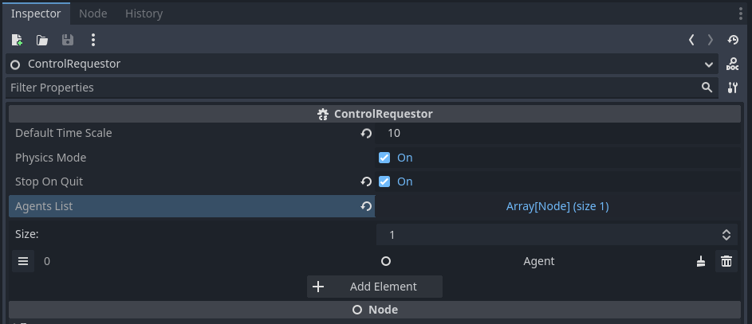
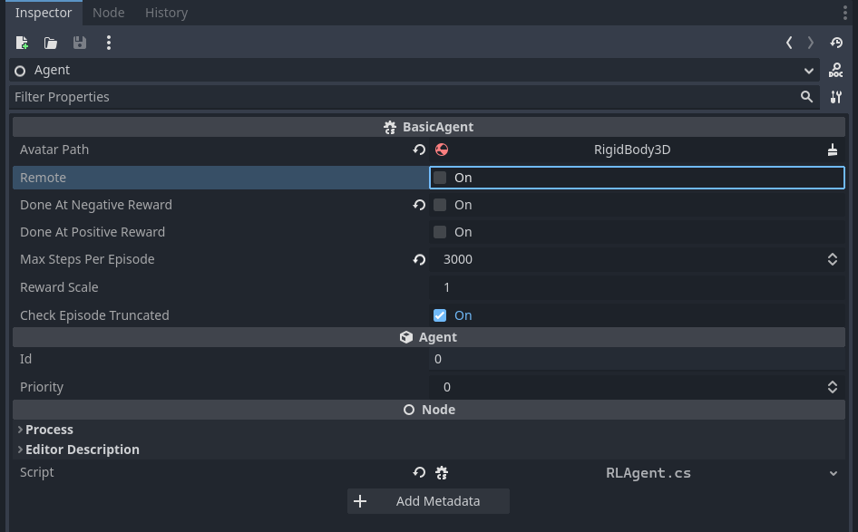
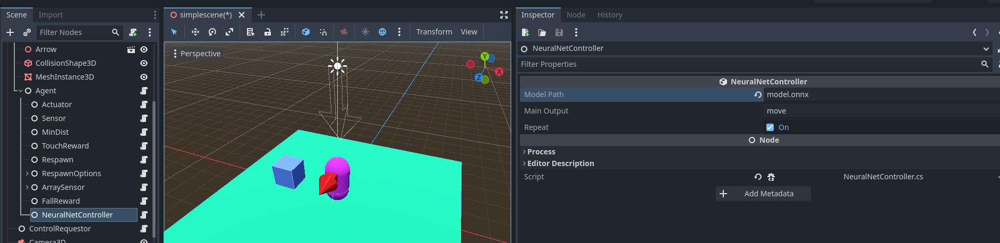
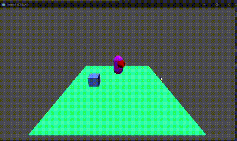

# Rodando um controlador baseado em ONNX diretamente na Godot
O ONNX (Open Neural Network Exchange) é um formato aberto para representar modelos de aprendizado de máquina. Ele permite que os modelos sejam treinados em um framework e consumidos em outro, proporcionando interoperabilidade entre diferentes frameworks.

No tutorial de [Introdução](introduction.md), mostramos como criar uma cena simples e treinar um agente para esta cena usando pytorch e python. No final, mostramos como rodar o modelo, mas usando python e comunicação remota entre o script python e a cena desenvolvida na Godot. Agora, vamos mostrar que o modelo gerado pelo nosso script python baseado em pytorch pode ser executado diretamente na Godot sem precisar da intermediação do pytorch. Para isso, usamos nossos scripts da ferramenta [bemaker](https/github.com/gilzamir18/bemaker) de converção do modelo pytorch no formato ONNX.

Para rodar a rede neural treinada diretamente na Godot usando AI4U, há duas etapas. Primeiramente, precisamos converter a rede neural treinada em ONNX. Depois, devemos usar um controlador baseado em rede neural disponível na AI4U. Este controlador depende de dois componentes externos: Microsoft.ML e Microsoft.ML.OnnxRuntime. Você pode instalar estes componentes diretamente via terminal usando o utilitário de linha de comando *dotnet* com o comando:

> dotnet add package <nomedopacote>

Vamos usar como exemplo o projeto desenvolvido para o tutorial de [Introdução](introduction.md). Este projeto pode ser baixado [aqui](https://1drv.ms/u/s!AkkX5pv0cl3aieYYTQz_d9S1kVhJAQ?e=rlCgnh).

## Instalando os componentes necessários
Baixe o projeto do tutorial de introdução, descompacte-o. Faça a importação deste projeto na Godot. Abre o terminal do teu sistema operacional na raiz deste projeto e execute os seguinte comandos:

> dotnet add package Microsoft.ML

> dotnet add package Microsoft.ML.OnnxRuntime

Se não ocorrer nenhum erro, significa que os componentes foram instalados corretamente.

## Convertendo o modelo treinado para o formato ONNX
Entre no diretório *AI4U/doc/trainer_example/scene_simplescene* e execute o comando:

> python  appgym_sb3test.py

> Veja os comandos para conversão do modelo do pytorch em onnx no arquivo appgym_sb3test.

Então rode a cena do projeto Demo1 na Godot. Isto vai gerar o arquivo *model.onnx*. Feche a cena e veja se o arquivo foi realmente gerado. Se a execução da cena gerar um erro de *NullReferenceException*, veja se o agente foi adicionado ao *ControlRequestor*. Caso não, adicione o agente como mostrado na *Figura 1*.

*Figure 1. Agente adicionado corretamente no ControlRequestor.*

Agora copie o arquivo model.onnx para a raiz do projeto Demo1 na Godot.

## Adicionando um NeuralNetController para o projeto Demo1

Precisamos rodar nosso agente no modo local. Para isso, no nó *Agent*, desabilite a opção Remote, como mostrado na *Figura 2*.

*Figure 2. Opção Remote desabilitada.*

Agora, vamos adicionar um nó do tipo *NeuralNetController* como filho do nó *Agent*, como mostra a *Figura 3*.

*Figure 3. Nó NeuralNetController e suas configurações.*

Pronto!!! Tudo que você tem que fazer agora é rodar localcamente o seu modelo. A *Figura 4* mostra o resultado final.

*Figure 4. Agente rodando na Godot com rede neural sem depender de python.*

