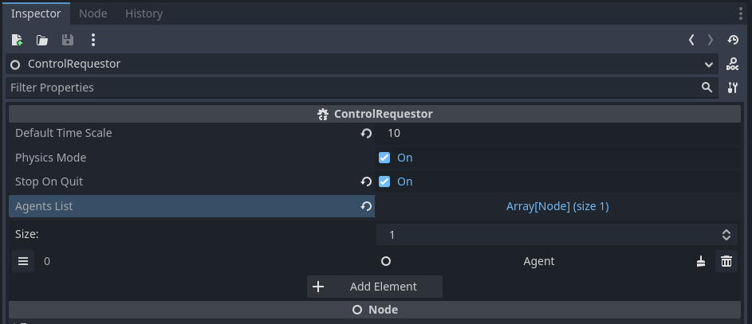
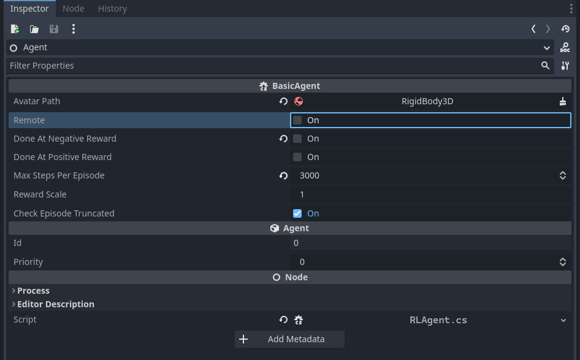
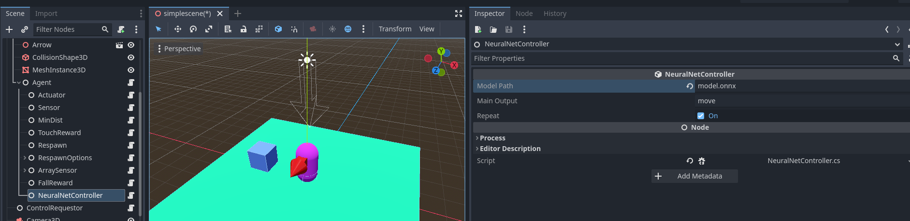
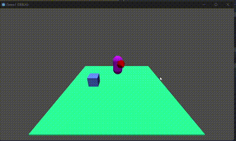

# Running an ONNX-Based Controller Directly in Godot

[Summary](summary.md)


## Requirements

If you try to run ONNX models, it is required to install `torch.onnx`:

```sh
pip install torch.onnx
```

The torch.onnx package depends on the onnx package. There is a bug in onnx installation in Windows 11 with Python 3.12, and a workaround is provided at https://github.com/onnx/onnx/issues/5773.

## Instructions
ONNX (Open Neural Network Exchange) is an open format for representing machine learning models. It allows models to be trained in one framework and consumed in another, enabling interoperability between different frameworks.

In the [Introduction](introduction.md) tutorial, we showed how to create a simple scene and train an agent for this scene using PyTorch and Python. In the end, we demonstrated how to run the model using Python and remote communication between the Python script and the scene developed in Godot. Now, we'll show that the model generated by our PyTorch-based Python script can be executed directly in Godot without the need for PyTorch mediation. For this, we use the method 
```python
sac_export_to("ai4u_model", metadata=env.controller.metadataobj) 
```
to convert the saved model (ai4u_model) into the ONNX format.

To run the trained neural network directly in Godot using AI4U, there are two steps. First, we need to convert the trained neural network into ONNX. Then, we must use a neural network-based controller available in AI4U. This controller depends on two external components: Microsoft.ML and Microsoft.ML.OnnxRuntime. You can install these components directly via the terminal using the *dotnet* command-line utility with the command:

> dotnet add package <package-name>

We'll use the project *BoxCase* developed for the [Introduction](introduction.md) tutorial as an example. This project can be downloaded [here](https://github.com/gilzamir18/ai4u_demo_projects).

## Installing the Necessary Components
Download the introduction tutorial project, unzip it, and import this project into Godot. Open your operating system's terminal at the root of this project and run the following commands:

> dotnet add package Microsoft.ML

> dotnet add package Microsoft.ML.OnnxRuntime

If no errors occur, it means the components were installed correctly.

## Converting the Trained Model to ONNX Format
Go to the *[AI4U/doc/trainer_example/scene_simplescene](https://github.com/gilzamir18/ai4u_demo_projects/tree/main/BoxChase/pytrainer/simple_scene)* directory and run the command:

> python  run.py

> See the commands for converting the PyTorch model to ONNX in the *run.py* file.

Then run the Demo1 project scene in Godot. This will generate the *model.onnx* file. Close the scene and check if the file was indeed generated. If running the scene produces a *NullReferenceException* error, check if the agent was added to the *ControlRequestor*. If not, add the agent as shown in *Figure 1*.



*Figure 1. Agent correctly added to ControlRequestor.*

Now copy the model.onnx file to the root of the BoxChase project in Godot.

## Adding a NeuralNetController to the Demo1 Project

We need to run our agent locally. To do this, in the *Agent* node, disable the Remote option, as shown in *Figure 2*.



*Figure 2. Remote option disabled.*

Next, add a *NeuralNetController* node as a child of the *Agent* node, as shown in *Figure 3*.



*Figure 3. NeuralNetController node and its settings.*

Done! All you have to do now is run your model locally. *Figure 4* shows the final result.



*Figure 4. Agent running in Godot with a neural network without relying on Python.*
