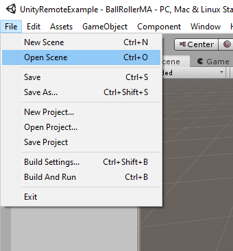
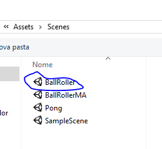
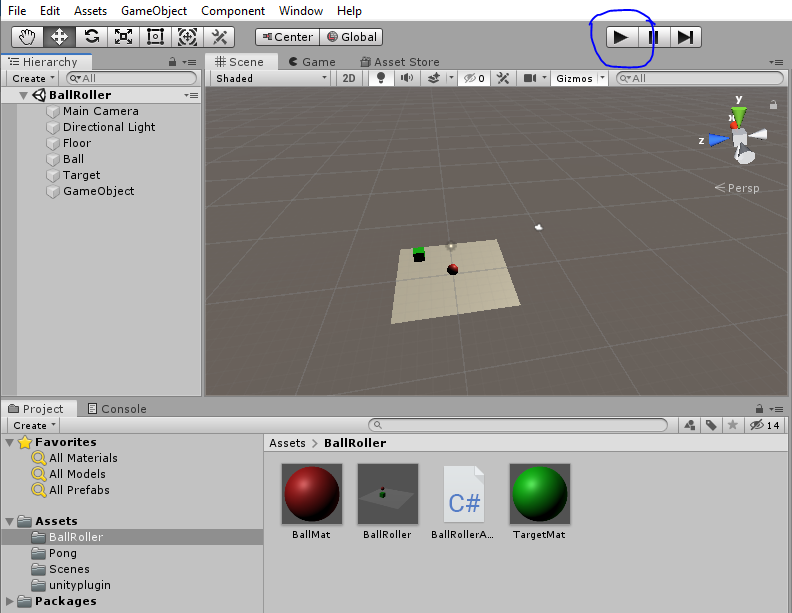
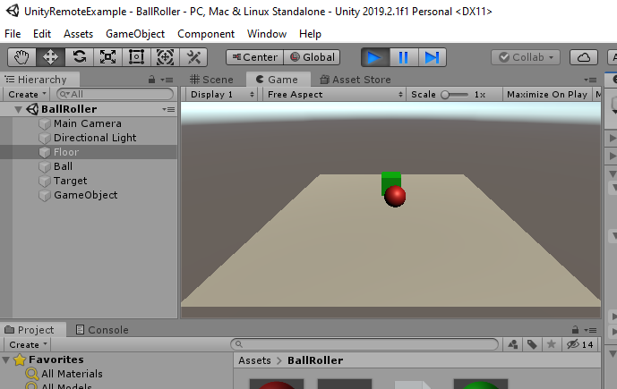
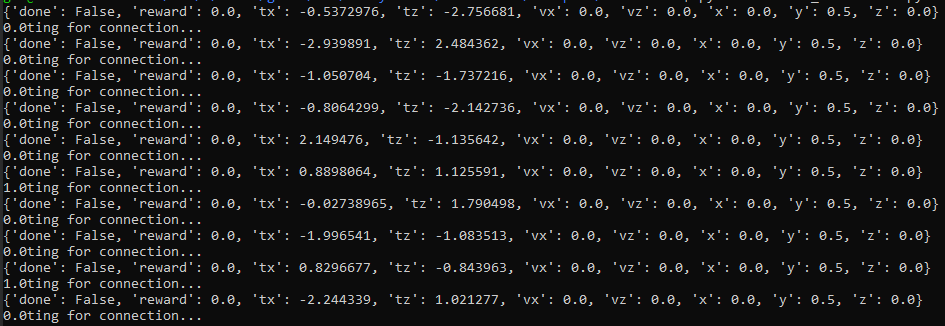

# AI4U for Godot

This is the Unity version of the AI4U tool. The Godot version of the AI4U get advantage of the Unity architecture and facilitate agent specification by means of an agent abstraction. In Unity, AI4U provides a alternative approach to modeling Non-Player Characters (NPC). Although, the developer can apply this tool in others situations as the environment modeling as an artificial intelligence test bed. 

Agent abstraction defines an agent living in a environment and interacting with this environment by means of sensors and actuators. So, NPC specification is a kind of agent specification. Agent's components are: sensors, actuators, events, reward functions and brain. Sensors and actuators are the interface between agents and environments. A sensor provides data to an agent's brain, while actuators send actions from agent to environment. A brain is a script that proccessing sensors' data e made a decision (selects an action by time).

We map components of the Unity architecture to agents components. So, agents components are stored as prefabs. A prefab is made component of game objects. A Game Object is a visible or not visible element of the game. Furthermore, the visible elements are statics or dynamics. Shortly, we will publish a full article on this relationship between Unity and agent abstraction. 


# Projects
Some projects were developed with AI4U for Unity. The list of major projects is shown in Table 1.

Table 2: Documentation.

| Tutorial        |                                    Link                                          |
|-----------------|---------------------------------------------------------------------------------------|
| MazeWorld    |  [Link](https://github.com/gilcoder/MazeWorldBasic)                                           |
| MemoryV1      | [Link](https://github.com/gilcoder/MemoryV1)                         |
| BoxChaseBall |  [Link](https://github.com/gilcoder/BoxChaseBall)                        |README

# How to use the AI4U?
AI4U has two components:
    * the *server-side* code written in C#. The second is the
    * *client-side* code written in Python.

For using AI4U, we recommend to have some mono version of Godot (with C# support) or Unity 2019 and start by looking at the examples available in the repository [AI4UExamples](https://github.com/gilcoder/AI4U). Start by example [AI4UExamples/CubeAgent](https://github.com/gilcoder/AI4UExamples/CubeAgent) for the first look in AI4U. Also, see the documentation available in directory *doc*. See the complete documentation in Table 2.

Table 2: Documentation.

| Tutorial        |                                    Link                                          |
|-----------------|---------------------------------------------------------------------------------------|
| API Overview    |  [doc/README.md](../../doc/README.md)                                           |
| AI4U with OpenAI Gym      | [doc/ai4ugym.md](../../doc/ai4ugym.md)                         |
| A3C Implementation     |  [doc/a3cintro.md](../../doc/a3cintro.md)                        |
| GMPROC (multiprocessing) | [GMPROC](../../clientside/ai4u/ai4u/gmproc/README.md)

## Installation
First, it needs to install *clientside* component. Open the Ubuntu command-line console and enter in directory *clientside/ai4u*. Run the following command:

```
pip3 install -e .
```

Waiting for the installation ends, this may take a while. To install gym and a3c algorithm support, go to directory *clientside/gym* and run the following command:

```
pip3 install -e .
```

Waiting for the installation ends.

Now, run Unity and open project available in *exemples/BallRoller*.  Then open the BallRoller scene (available on *Assets/scenes*) if it is not already loaded.






Then, press the play button and run the random_ballroller.py script located in *examples/BallRoller/Client*.



```
python3 random_ballroller.py
```



Output logs:


If no error message was displayed, then AI4U was installed correctly.

# Requirements

Tested Systems
----------

- Operation System: Ubuntu 18.04, and 19.10.
     * Python >= 3.7.5.
     * Unity >= 2019.4 (64 bits for GNU/Linux).

- Operation System: Ubuntu >= 20.04
    * Anaconda Python "3.7" version
    * Unity >= 2019.4 (64 bits for GNU/Linux).

- Operation System: Windows 10
    * Anaconda Python "3.7" version.
    * Unity >= 2019.4 (64 bits for Windows)

Unfortunately, AI4U does not have support for mobile applications.
